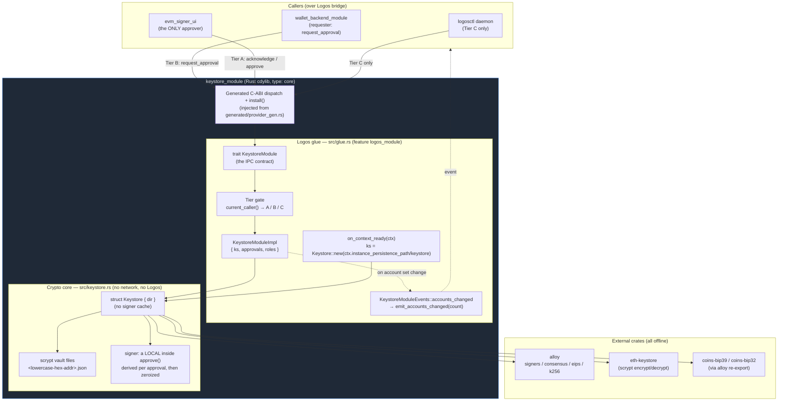
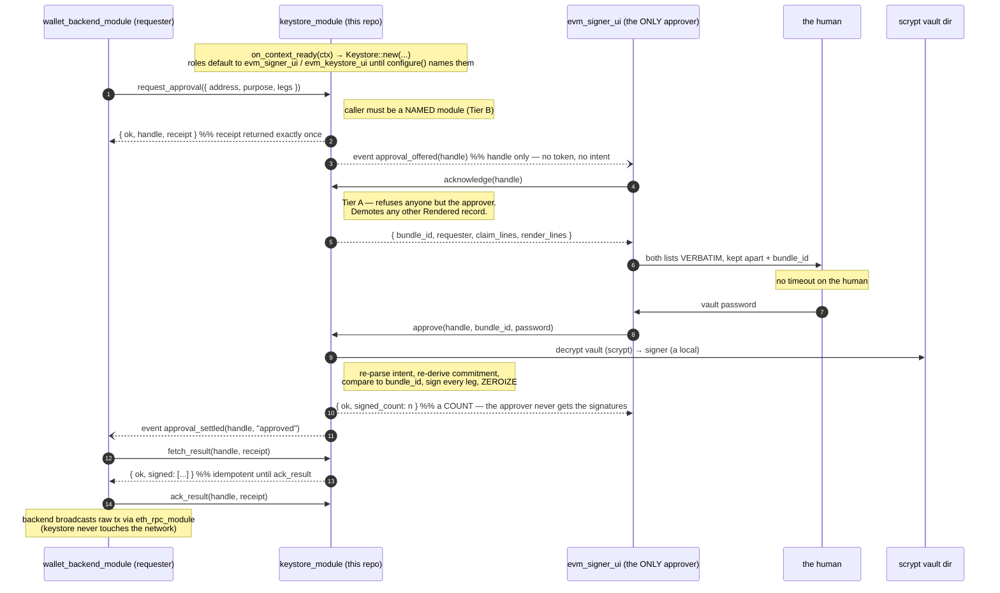

# `logos-evm-keystore-module` — Reference Specification

## Purpose

`logos-evm-keystore-module` is the **keystore** for the Logos multi-chain EVM
wallet. It is a Rust **cdylib Logos module** (`type: core`, `interface: cdylib`)
that owns everything to do with private keys: generating and importing them,
encrypting them at rest as scrypt vaults, and producing **secp256k1 signatures**
**only when a human has approved them** — both EIP-191
`personal_sign` messages and signed EIP-1559 / legacy (EIP-155) transactions.

Its defining property is **isolation**: the module does **no networking**, and a
raw private key never crosses the module's IPC boundary. The only values that
leave the module are **addresses**, **signed payloads** (signature hex / raw
signed-transaction hex), and **(re-)encrypted keystore JSON**. The crypto core is
built on well-established crates — [`alloy`](https://github.com/alloy-rs/alloy)
(signing + transaction encoding), [`eth-keystore`](https://crates.io/crates/eth-keystore)
(Web3 Secure Storage scrypt vaults), and `coins-bip39` / `coins-bip32` (BIP-39 /
BIP-32 HD derivation, consumed through alloy's re-export).

### Where it sits in the EVM wallet system

The EVM wallet is built from seven repositories that talk to each other as
process-isolated Logos modules over a typed RPC bridge:

| Repo | Role | Talks to |
|------|------|----------|
| `logos-evm-net-proxy` | Fail-closed HTTP/RPC client **library crate** (not a module) | — |
| **`logos-evm-keystore-module`** | **Key management + signing (this repo)** | **nothing — leaf module** |
| `logos-evm-eth-rpc-module` | Multi-chain JSON-RPC transport (`concurrency: multi`) | net-proxy |
| `logos-evm-token-list-module` | Token-list fetch/merge per chain | net-proxy |
| `logos-evm-uniswap-module` | Uniswap V2/V3/V4 price oracle + swap building (`concurrency: multi`) | eth-rpc |
| `logos-evm-wallet-backend-module` | Coordinator + tx builder (alloy) | keystore, eth-rpc, token-list, uniswap |
| `logos-evm-wallet-ui` | Universal C++ `ui_qml` app | wallet-backend |

This module is a **leaf**: it declares **no dependencies** (`"dependencies": []`)
and calls no other module. It is driven *by* the `logos-evm-wallet-backend-module`
coordinator (which *requests* an approval as the signing leg of its
send pipeline, and never handles a vault password) or directly by the headless `logosctl`
runtime. Keeping the keystore a dependency-free leaf is deliberate: the component
that holds private keys has the smallest possible attack surface and pulls in no
network-capable code.

---

## Overall architecture

The module is two layers that are deliberately decoupled by a Cargo feature:

* **The crypto core** (`rust-lib/src/keystore.rs`) — pure, offline, Logos-free
  Rust. The `Keystore` struct manages a directory of scrypt vault files. It holds **no**
  decrypted keys: a signer is derived per approval and zeroized before the call
  returns. Unit-tested on its own with
  `cargo test --no-default-features`.
* **The Logos glue** (`rust-lib/src/glue.rs`) — the `KeystoreModule` contract
  trait and its implementation, compiled only behind the default `logos_module`
  feature. It marshals every structured value across the IPC boundary as a JSON
  string, wires the on-context-ready hook to a persistence path, and emits
  `accounts_changed` after every mutation that changes what a reader displays.



**Key isolation, restated against the diagram:** raw private-key bytes exist only
inside `Core` — encrypted in the vault files, and decrypted **only into a local
variable inside `approve()`**, which zeroizes it before returning. There is no
map, no cache and no TTL, so there is no window during which some *other* caller
could reach a live signer. Keys are never returned through `TRAIT`. Only
`Address` strings, signature/transaction hex, and re-encrypted keystore JSON
travel back across the `DISP` boundary — and a signature only ever leaves as the
result of a `Rendered` request a human approved.

---

## Communication with dependencies

This module is a **leaf** — it makes **no outbound calls** to any other module
and opens no sockets. The interesting flow is therefore how a **caller drives it**.
The canonical flow has **three** parties, not two: a **requester** that may ask
but never approve, the **approver** (`evm_signer_ui`) that renders and takes the vault
password, and the human. `logosctl` can reach Tier C only.



The signed values the backend collects are what it hands to `eth_rpc_module` for
`eth_sendRawTransaction`. The keystore itself never performs that broadcast — it
has no network code at all. Note the password crosses **only** the `evm_signer_ui` →
`keystore` edge: the requester never sees it, never sees `render_lines`, and
cannot produce a signature.

---

## Full API reference

The contract is the `KeystoreModule` trait in `rust-lib/src/glue.rs`. The builder
derives the module's `.lidl` interface from this trait (`codegen.rust =
{ crate: "rust-lib", trait: "KeystoreModule", source: "src/glue.rs" }`); every
**non-defaulted** trait method becomes a callable module method. `on_context_ready`
is *defaulted*, so it is a framework hook and **not** part of the IPC contract.

### Conventions

* **Structured returns are JSON strings.** Methods that return `String` return a
  JSON object that is either `{ "ok": true, … }` on success or
  `{ "ok": false, "error": "<message>" }` on failure. The `err()` helper produces
  the error shape; the message text comes from `KeystoreError` (`Display`).
* **Boolean methods** (`has_address`, `delete_account`, `ack_result`,
  `cancel_approval`, `reject`) return a bare `bool` and are **fail-soft**: any internal
  error (bad address, wrong password, keystore not yet initialized) maps to
  `false` rather than an error object.
* **Addresses** are accepted with or without a `0x` prefix, in any case; no EIP-55
  checksum is required (`parse_address` decodes the 20 raw bytes directly). The
  `logosctl` CLI auto-types a `0x…` argument as a number, so in CLI examples
  addresses are passed as **bare hex**.
* **Numeric transaction fields** cross as hex (`0x…`) **or** decimal strings to
  avoid precision loss over JSON; empty/missing numeric fields default to `0`.
* **`logosctl call` argument typing:** `true`/`false` → bool, integers → int,
  else string; `@file` loads file contents as the argument.

### Method index

| Method | Params | Returns | Mutates accounts? |
|--------|--------|---------|-------------------|
| `configure` | `config_json: String` | `{ ok, approvers, custodians }` | no — sets who may |
| `create_mnemonic` | `words: i64` | `{ ok, phrase }` | no |
| `import_mnemonic` | `params_json: String` | `{ ok, address, path, group, storage, index, origin }` | yes → event |
| `derive_next_account` | `params_json: String` | `{ ok, address, path, group, index, origin }` | yes → event |
| `derive_account_at` | `params_json: String` | `{ ok, address, path, group, index, origin }` | yes → event |
| `preview_addresses` | `params_json: String` | `{ ok, group, addresses: [..] }` | no |
| `create_unrelated_account` | `params_json: String` | `{ ok, address, origin }`, or a refusal without the acknowledgement | yes → event |
| `forget_derivation` | `params_json: String` | `{ ok, group, storage, recordUpdated, stranded, stagedRemoved }` | no |
| `remove_group` | `params_json: String` | `{ ok, group, recordRemoved, nameRemoved }` | no — refuses while the wallet holds a key or an account |
| `list_groups` | — | `{ ok, groups: [..] }` | no |
| `list_derivation_keys` | — | `{ ok, groups: [id, ..], staged: [id, ..], unexplained: [path, ..], links: [..] }` | no |
| `get_provenance` | — | `{ ok, accounts: {..} }` | no |
| `settle` | — | `{ ok, swept, promoted, unexplained, links, staged, importStages }` | removes leftovers |
| `remove_unexplained` | `params_json: String` | `{ ok, removed }` | removes one reported path |
| `import_private_key` | `priv_hex: String, password: String` | `{ ok, address }` | yes → event |
| `import_keystore_json` | `key_json, password, new_password: String` | `{ ok, address }` | yes → event |
| `export_keystore_json` | `address, password: String` | `{ ok, keystore }` | no |
| `list_accounts` | — | `{ ok, accounts: [..], staged: [..], unexplained: [path, ..], mismatched: [..] }` | no |
| `has_address` | `address: String` | `bool` | no |
| `delete_account` | `address, password: String` | `bool` | yes → event |
| `set_label` | `address, label, password: String` | `{ ok }` | no |
| `get_labels` | — | `{ ok, labels: { <address>: <name> } }` | no |
| `set_group_label` | `params_json: String` | `{ ok }` | no |
| `get_group_labels` | — | `{ ok, labels: { <groupId>: <name> } }` | no |
| `request_approval` | `intent_json: String` | `{ ok, handle, receipt, state }` | no |
| `approval_status` | `handle, receipt: String` | `{ ok, state, reason? }` | no |
| `fetch_result` | `handle, receipt: String` | `{ ok, signed: [..] }` | no |
| `ack_result` | `handle, receipt: String` | `bool` | no |
| `cancel_approval` | `handle, receipt: String` | `bool` | no |
| `pending` | — | `{ ok, pending: [..] }` | no |
| `acknowledge` | `handle: String` | `{ ok, bundle_id, requester, claim_lines, render_lines }` | no |
| `approve` | `handle, bundle_id, password: String` | `{ ok, signed_count: n }` | no |
| `reject` | `handle: String` | `bool` | no |
| `caller_identity` | — | `{ ok, kind, identity, approvers, custodians }` | no |

---

### `configure(config_json: String) -> String`

Name who holds the two roles. `config_json` is `{ approvers?, custodians? }`; the reply is
`{ ok, approvers, custodians }` echoing what is now in force, or the usual
`{ ok: false, error }`. It takes effect on the next call — nothing is reloaded.

**A role is a set.** Each key takes one name or a list of them, because a terminal signer
has to approve *alongside* `evm_signer_ui` rather than by displacing it. Blanks and repeats are
normalised out, so `is_empty()` and "admits nobody" can never disagree. The pre-list
`approver`/`custodian` spelling is refused as an unknown key — the right way for a stale
configuration to fail, since accepting it silently would empty both roles.

**Total, not a patch.** The document is the whole answer to who holds these roles, so one
it does not name is held by **nobody**: `gate::holds_any_role` refuses an empty set, and
every method of that tier then refuses everyone. Half a configuration inheriting the other half
from a default is how a deployer who replaced one surface goes on granting the old one.
Whitespace is not a module name, so a blank string means nobody rather than an unmatchable
somebody.

**Refusals leave the gate where it stood.** A document that is not a JSON object, carries an
unknown key, or types a role as anything but a string is refused whole and the roles in
force are untouched — there is no partial apply. The unknown-key rule exists because under
the total rule a typo (`custodain`) would otherwise empty **both** roles: fail-closed, but
silent about why everything started refusing.

**Until it is called, the built-in defaults stand** — `evm_signer_ui` approves, `evm_keystore_ui`
mutates. A module nobody configures is not inert.

#### It is deliberately ungated, for now

Any caller can call `configure`, name **itself** custodian, and then mutate the keystore.
That is a real exposure and it is a deliberate, temporary one: protecting this call is
**deferred, not refuted**.

The design this replaced put the two role names in `<persistence>/keystore.json`, read once
in `on_context_ready`, on the stated ground that *who may mutate the keystore is
configuration, not a method — a `set_custodian` call would be a remotely-writable answer to
"who may import a key."* That reasoning still holds; what did not hold was the delivery. A
module's persistence directory is owned by the module instance and may be sandboxed with no
other process able to reach it, so configuration cannot be **placed** there from outside —
and in practice it did not even exist until the module had written to it, which put the
config out of reach at exactly the moment it was needed. Configuration has to arrive by
method call.

What is still owed is the protection the file gave for free: an answer to "who may set
policy" that is not simply "whoever calls first". Claim-once semantics, a caller gate, or a
platform-level configuration channel are all candidates; none is implemented here. Until one
is, treat the roles as advisory against a hostile co-resident module and load-bearing against
an honest one.

---

### `create_mnemonic(words: i64) -> String`

Generate a fresh BIP-39 English mnemonic. **Does not persist anything** — the
caller decides whether to import the phrase. The phrase is produced from
`rand::thread_rng()` and returned in cleartext (it is *not* a private key per se,
but it is seed material — treat it as a secret).

* **`words`** — word count. Must be one of `12 | 15 | 18 | 21 | 24`; any other
  value returns an error.

**Success:** `{ "ok": true, "phrase": "word1 word2 … wordN" }`
**Error:** `{ "ok": false, "error": "word count must be 12/15/18/21/24, got 13" }`

```bash
logosctl call keystore_module create_mnemonic 12
# → {"ok":true,"phrase":"… twelve words …"}
```

---

### `import_mnemonic(params_json: String) -> String`

Derive an account from a mnemonic along the BIP-44 Ethereum path
`m/44'/60'/<bip44Account>'/<change>/<accountIndex>`, persist its scrypt vault, and
create the account's **derivation group**. The argument is a **JSON object**
(`ImportMnemonicParams`):

| Field | Type | Required | Meaning |
|-------|------|----------|---------|
| `phrase` | string | yes | The BIP-39 mnemonic |
| `passphrase` | string | no (default `""`) | BIP-39 passphrase (the "25th word"). ASCII only — see below |
| `accountIndex` (alias `account_index`) | u32 | no (default `0`) | The **address** index — the fifth path level |
| `password` | string | yes | Vault password used to scrypt-encrypt the derived key on disk |
| `storage` | string | no (default `"plain"`) | `"plain"` keeps nothing; `"extkey"` keeps the account key so later accounts can be derived without the phrase |
| `bip44Account` | u32 | no (default `0`) | The **hardened BIP-44 account** level — the third |
| `change` | u32 | no (default `0`) | `0` external, `1` change |
| `groupPassword` | string | required when `storage` is `"extkey"` | Password for the group's own derivation-key vault |
| `groupLabel` | string | no | Human name for the wallet |

`accountIndex` and `bip44Account` are **different levels** and the names are a
trap worth reading twice: `accountIndex` predates the BIP-44 account level and
still means the address index.

`storage` defaults to `"plain"`, so a pre-HD call shape behaves exactly as it did
— nothing is retained and the group is recorded as not derivable. On success emits
`accounts_changed`.

**Success:** `{ "ok": true, "address": "0x…", "path": "m/44'/60'/0'/0/0", "group": "g_…", "storage": "plain", "index": 0, "origin": "derived" }`
**Error:** `{ "ok": false, "error": "<parse / derivation error>" }`

```bash
logosctl call keystore_module import_mnemonic \
  @mnemonic.json   # {"phrase":"test test … junk","accountIndex":0,"password":"pw"}
# → {"ok":true,"address":"0xf39Fd6e51aad88F6F4ce6aB8827279cffFb92266", …}
```

**The BIP-39 passphrase is part of the secret.** Same phrase, different passphrase
⇒ a completely disjoint account tree. It is **not stored** and **not recoverable**;
losing it loses the accounts as completely as losing the phrase. It is also **not
trimmed** — a trailing space is a different passphrase, and trimming would derive
accounts no other wallet recovers.

**Non-ASCII passphrases are refused.** BIP-39 salts with the NFKD form of the
passphrase; `coins-bip39` salts with the raw bytes it is handed, so `"café"` typed
NFC and NFD would derive different accounts here and a normalizing wallet would
disagree with both. ASCII is NFKD-invariant, so refusing now keeps the option of
normalizing later **without changing any address that is derivable today**.

---

### `new_account` — **removed**

`new_account(password)` created an account from a random key. It has no replacement of
the same shape, on purpose: [`create_unrelated_account`](#create_unrelated_accountparams_json-string---string)
is now the only way to obtain a random key, and it requires an explicit acknowledgement.

The method was safe only where the keystore held no recovery phrase, so it grew a guard
that scanned the directory and refused when it found derivation material. Seven rounds of
fix-and-review could not make that guard sound, and the reason is structural rather than a
missing case:

* every name the layout recognises becomes a hiding place — material wearing a recognised
  name (`labels.json`, `.lock`) skipped the content check entirely and minted;
* every name it does **not** recognise has to count as possible key material, so any stray
  file wedged the store;
* an account key and a derivation key **are the same shape**, and telling them apart needs
  the password.

"Is there live key material anywhere under this store" is not decidable by inspection. The
danger was never "a key exists on disk" — it was "a user got an unrecoverable key without
knowing". That is made impossible directly: a random key may only be obtained through a
door that says what it does and requires the acknowledgement, and no on-disk state either
grants or withholds one.

Callers that were calling `new_account` on an HD wallet want
[`derive_next_account`](#derive_next_accountparams_json-string---string); callers that
really wanted a random key want `create_unrelated_account` and now have to say so.

---

### `import_private_key(priv_hex: String, password: String) -> String`

Import a raw secp256k1 private key and persist its scrypt vault. The key is
consumed and immediately re-encrypted — it is not retained in cleartext beyond the
call, and it is never returned. Emits `accounts_changed`.

* **`priv_hex`** — 32-byte private key in hex, with or without a `0x` prefix.
* **`password`** — vault password.

**Success:** `{ "ok": true, "address": "0x…" }`
**Error:** `{ "ok": false, "error": "invalid private key: …" }`

```bash
logosctl call keystore_module import_private_key \
  ac0974bec39a17e36ba4a6b4d238ff944bacb478cbed5efcae784d7bf4f2ff80 pw
# → {"ok":true,"address":"0xf39Fd6e51aad88F6F4ce6aB8827279cffFb92266"}
```

---

### `import_keystore_json(key_json: String, password: String, new_password: String) -> String`

Import an existing scrypt **keystore JSON** (Web3 Secure Storage format),
decrypting it with `password` and **re-encrypting** it under `new_password` into a
fresh local vault. The decrypted key never leaves the module. Emits
`accounts_changed`.

* **`key_json`** — the source keystore JSON (a string; written to a short-lived
  temp file because `eth-keystore` is path-based, then decrypted).
* **`password`** — password that decrypts the *incoming* keystore JSON.
* **`new_password`** — password used to re-encrypt the vault stored locally.

**Success:** `{ "ok": true, "address": "0x…" }`
**Error:** `{ "ok": false, "error": "vault error: …" }` (wrong `password`, malformed JSON, etc.)

---

### `export_keystore_json(address: String, password: String) -> String`

Export an account as scrypt keystore JSON **without touching the on-disk vault**.
The password is **verified** (the vault is decrypted to prove the password is
correct) and then the canonical on-disk JSON contents are returned. The exported
JSON is itself scrypt-encrypted — it is *not* a cleartext key.

* **`address`** — account to export (with/without `0x`, any case).
* **`password`** — the vault password (must decrypt, else error).

**Success:** `{ "ok": true, "keystore": "<keystore JSON string>" }`
**Error:** `{ "ok": false, "error": "vault error: …" }` (wrong password or missing vault)

---

### `list_accounts() -> String`

List the addresses of all persisted vaults, through the one directory scan (see
[Directory layout](#directory-layout)). The list is sorted.

Two fields beyond the addresses, both of which used to be dropped in silence:

* **`staged`** — a vault an interrupted write left at `.stage-<addr>/`. Normally
  empty: the call settles the directory first, promoting such a copy to its real
  path (it is the ONLY copy of that key) or reaping it when the real vault is
  already there. It is non-empty only when the repair itself could not run.
* **`unexplained`** — paths under the keystore directory that this module did not
  write: a hand-placed `backup.json`, a `.DS_Store`, a leftover from an older
  version. **Reported, not refused** — listing and signing keep working whatever
  is here, and a wallet must not be bricked by a stray file. Both severities appear
  (see *possible key material* below): a bucket is a severity, never a filter on
  what a reader is shown.

* **`mismatched`** — vault files whose own `address` field disagrees with their
  filename, as `<file> holds 0x<address>`. They are **not listed as accounts**: the
  two claims cannot both be true, and the wallet must not report an address whose
  vault disputes it. They also appear in `unexplained`, so `remove_unexplained`
  reaches them.

A filename is a **claim**, never a proof. Where a vault declares no address — the
ones this module writes do not — the mismatch is not knowable without a password, so
it is caught at every *use* instead: `sign_message`, `sign_digest`,
`export_keystore_json`, `change_password`, `delete_account` and `approve` all
re-derive the address from the decrypted key and refuse if it is not the one that
was asked for. Before that check, a vault renamed onto another address's filename
signed as that address, with a key that was never its own.

**Success:** `{ "ok": true, "accounts": ["0x…"], "staged": [], "unexplained": [], "mismatched": [] }`
**Error:** `{ "ok": false, "error": "keystore not initialized (context not ready)" }`,
or `{ "ok": false, "error": "<dir> is unreadable, and an unreadable file is not an
empty one …" }`. An UNREADABLE keystore directory refuses. It used to return an
empty array, so a user with a funded wallet was told they had none.

```bash
logosctl call keystore_module list_accounts
# → {"ok":true,"accounts":["0xf39Fd6e51aad88F6F4ce6aB8827279cffFb92266"],"staged":[],"unexplained":[],"mismatched":[]}
```

---

### `has_address(address: String) -> bool`

Return `true` iff a vault file exists for `address`. Fail-soft: an invalid address
or uninitialized keystore returns `false`.

* **`address`** — address to check.

```bash
logosctl call keystore_module has_address f39fd6e51aad88f6f4ce6ab8827279cfffb92266
# → true
```

---

### `delete_account(address: String, password: String) -> bool`

Permanently delete an account's vault. **Password-gated**: the vault is decrypted
with `password` first; only on success is the file removed. Emits `accounts_changed`. Returns `true` only when a vault existed, the
password was correct, and the file was removed; `false` otherwise (missing vault,
wrong password, parse error).

* **`address`** — account to delete.
* **`password`** — its vault password (required to authorize deletion).

```bash
logosctl call keystore_module delete_account <address> pw
# → true
```

---

### Naming accounts and wallets

Four methods: the two `set_` calls are **Tier D** *and* need a password (below), and the
two `get_` calls are **ungated** (a name is not a secret, and a picker needs it). Both
`set_` calls emit `accounts_changed` on success — a rename changes what every picker on
the machine is showing, and the count in the payload does not move.

| Method | Params | Returns |
|--------|--------|---------|
| `set_label` | `address: String, label: String, password: String` | `{ ok: true }` |
| `get_labels` | — | `{ ok: true, labels: { "<address>": "<name>" } }` |
| `set_group_label` | `params_json: String` — `{ group, label, address?, password? }` | `{ ok: true }` |
| `get_group_labels` | — | `{ ok: true, labels: { "<groupId>": "<name>" } }` |

```bash
logosctl call keystore_module set_group_label \
  '{"group":"g_0123456789abcdef0123456789abcdef","label":"Cold storage","address":"f39F…","password":"pw"}'
# → {"ok":true}
logosctl call keystore_module get_group_labels
# → {"ok":true,"labels":{"g_0123456789abcdef0123456789abcdef":"Cold storage"}}
```

**Setting a name needs a password; clearing one never does.** A label is what a reader
shows *in place of* an address, so writing one is a claim of custody — and until this
landing it was the one keystore mutation with no proof behind it, while delete, export
and change-password each had one. What is required depends on what the name speaks for:

| What is named | To SET a name | To CLEAR one |
|---------------|---------------|--------------|
| an account | that account's own vault password | nothing |
| a wallet with ≥1 account | `address` + `password` of **one of its own accounts** | nothing |
| a wallet with no accounts but a key on disk | `password` of that **derivation key** (no `address`) | nothing |
| a wallet that holds nothing | nothing — no accounts and no key, so it names nothing and can never gain anything to name | nothing |

The wallet is priced by what it **holds**, from the one `Holdings` predicate `remove_group`
refuses on — not by whether it happens to have accounts *today*. Holding any account is
precisely the claim "this wallet is mine", and where there are accounts the **group**
password is still *not* accepted: it proves you can *make* accounts, not that you own the
ones the header speaks for. With **no** accounts that rejection has nothing to reach — there
are none to own, and the only thing the name will come to stand for is the accounts that key
mints — so the key's own password is exactly the right proof.

This costs the free rename of a **stranded** key, which an earlier landing exempted as "the
row you most need to name before deleting it, and the one whose password is most likely
lost". The exemption rested on a stranded key never gaining a record, which is a promise
made by the very bookkeeping that is already damaged — and this module's rule is that the
*file* is the fact. Nothing that matters is lost: `forget_derivation` still deletes such a
key with **no** password, and clearing a stale name still needs none.

Refusals: `the password for this account is not correct` (identical for a wrong password
and for an unreadable vault — a name is not worth an oracle that tells them apart),
`naming a wallet that has accounts needs the password of one of them`, `that account
does not belong to this wallet` (identical whether the address is unknown, malformed, or
another wallet's, and it never echoes the value it was given — a swapped
`(address, password)` pair must not put the password into an error string), `naming a
wallet that keeps a derivation key needs that key's password`, and `the password for this
wallet's derivation key is not correct`. The staged copy an interrupted import left opens
the wallet just as the live key does, so it is proved against just the same.

**This is defence in depth, not the boundary.** Tier D already admits exactly one caller,
so an attacker able to call `set_label` at all *is* the custodian UI. What the password
buys is parity with the other destructive mutations, against a different adversary: a
human at an unlocked machine, or anything that can drive the UI without knowing a secret.
The larger part of the impersonation risk is not here at all — it is that a reader renders
a name *instead of* an address. The mitigation that removes it is showing both
(`Treasury · 0x7099…79C8`) wherever an account is chosen.

An empty or whitespace-only `label` **clears** the name; anything else is stored
trimmed. `set_group_label` refuses a group nothing on disk knows about
(`{"ok":false,"error":"invalid parameters: no such group: g_…"}`), and an id that is
not a well-formed group id (`invalid parameters: invalid group id …`) — but it accepts
a group named by *any* of the four facts the keystore holds: its record in `groups.json`, its key under
`groups/`, an account whose provenance points at it, or a name already standing over it in
`group-labels.json`. A wallet a reader can see is one it can name, and a **stranded** key,
a lost record or a leftover name is exactly when it needs to.

`get_group_labels` answers from `group-labels.json` alone, so it stays readable when
`groups.json` is not — which is what lets a UI name the wallet it is asking the user
whether to delete. The same name is also mirrored onto each row of `list_groups` as
`label`, stranded rows included; a name a build before this one wrote into
`groups.json` is still shown, and the first rename moves it out of the record so a
cleared name cannot resurface.

**No uniqueness rule.** Two wallets may carry one name. Which of them a reader is
looking at is a question for whatever renders them — refusing the write would only
stop it showing what the user actually did.

**Refuses rather than reads as empty.** A present-but-unreadable `group-labels.json`
fails every one of these calls, and `list_groups` with it — see *Three states, not
two*. Writing over it would silently erase every name it held.

---

## HD account derivation (BIP-32 / BIP-44)

### The path, and why it is not configurable

```
m / 44' / 60' / account' / change / index
    │     │      │          │        └── address index.   NOT hardened. 0 ≤ index < 2^31
    │     │      │          └─────────── 0 = external, 1 = change. NOT hardened.
    │     │      └────────────────────── BIP-44 account.  HARDENED.  0 ≤ account < 2^31
    │     └───────────────────────────── coin type 60 = Ethereum (SLIP-44). HARDENED.
    └─────────────────────────────────── purpose 44 (BIP-44). HARDENED.
```

Hardening breaks the relation `k_parent = k_child − IL` at that level, because a
hardened child's `IL` is derived from the parent *private* key. BIP-44 hardens the
three levels whose compromise crosses a boundary a user cares about (purpose, coin,
account) and leaves the two below open. Ethereum wallets rarely use `change = 1`,
but **the level must be present**: `m/44'/60'/0'/0` is a different key from
`m/44'/60'/0'/0/0`.

**Purpose and coin type are never editable through the API.** A "custom path" that
can change them is a way to make funds unrecoverable, dressed as a feature.

**Paths are parsed by this module, never handed to the crate's parser**
(`rust-lib/src/hd.rs`). `coins-bip32` filters an `m` segment *anywhere* in the
string, so `"m/44'/60'/m/0/0"` parses there as a four-level path; and its
`harden_index` is a bare `index + 2^31`, so `2147483648'` panics in debug and wraps
in release. Both produce addresses no other wallet recovers. This module parses five
components itself, checks each level, and reconstructs the canonical string.

### Derivation groups

A **group** is one `(mnemonic, BIP-39 passphrase, BIP-44 account)` triple. The
storage choice is made once, at import, for the whole group — it cannot be per
account, because the account key that derives index 3 derives index 5 as well.
Claiming otherwise would be a lie about what is recoverable.

| `storage` | What is kept | What that reaches |
|-----------|--------------|-------------------|
| `plain` (default) | nothing | — adding an account later needs the phrase again |
| `extkey` | the **account** key `m/44'/60'/<account>'`, in its own scrypt vault | every address under that one Ethereum account: both chains, every index, past and future |

**The root key is never stored, returned, or accepted.** No method emits one, and
`decode_account_key` refuses any extended key that is not at depth 3 — a group
opened from a root would silently reach every SLIP-44 coin and every BIP-44
account. The account key produces exactly the addresses this module can ever
produce, and nothing else.

**No xpub is exposed, in any tier.** Below the account level BIP-44 is
non-hardened, so an account xpub *plus any one derived private key* yields the
parent xprv and with it every sibling — including addresses the user has not created
yet. `export_keystore_json` makes exporting one account's vault easy and legitimate;
today that costs one account, and an xpub in circulation would silently make it cost
the whole account tree. There is also no consumer: this module has no network, and
balance lookup lives in `eth_rpc_module`, which is handed explicit addresses.

**The trade, stated in both directions.** `plain` has the smaller *at-rest*
footprint: someone who copies the directory and guesses one account's password gets
one account. `extkey` has the smaller *in-use* footprint: it runs `to_seed` exactly
once, ever, while `plain` sends the phrase back through the UI and the IPC boundary
for every future account, and `coins-bip39::to_seed` leaks two un-wiped heap strings
per call. The default is `plain`, because the `extkey` benefit is a convenience and
its cost is a security property.

**Changing your mind.** `extkey` → `plain` is supported (`forget_derivation`) and is
a real, cheap reduction in exposure. It stays reachable even when the group's record
is missing or unreadable, because it is keyed on the key files rather than on the
bookkeeping — and even when the key itself can no longer be opened, because deletion
does not require reading what it deletes. `plain` → `extkey` is **impossible** — the material is not there — and
the module does not pretend otherwise: the only honest offer is importing the phrase
again with `storage: "extkey"`, which re-derives the same addresses.

**Residual, stated rather than papered over.** The extended key cannot be fully
wiped: `coins-bip32`'s `XKeyInfo` is `Copy` and carries an un-zeroized 32-byte chain
code, so every derivation step leaves copies behind. A chain code alone is not a key;
a chain code plus any child private key is the parent xprv. The base58 form is held
in `Zeroizing` and live `XPriv` values are kept to a minimum.

### Index tracking

`nextIndex` lives per group in `groups.json` and is a **cache, not the authority**.
It is recomputed on every use as
`max(nextIndex, 1 + max index recorded in accounts.json for this group)`, so a
corrupted or hand-edited sidecar can only *skip* an index — never hand out one
already in use. A gap costs nothing; a collision is two vaults claiming one address.

**Deleting an account retires its index; it is never reused.** A reused path may
collide with an account that still holds funds, and re-deriving it under a fresh
password creates two vaults' worth of ambiguity about which password opens what.
Gaps are what every other wallet produces.

**Gap scanning against the chain is deliberately absent.** Knowing whether an
address has history requires an RPC, and this module has no network by construction
(see [Security model](#security-model--invariants)). The shape that keeps the network
where it already is:

```
keystore_module.preview_addresses  → addresses only, no keys, no writes, no network
eth_rpc_module                     → "which of these have history?"
keystore_module.derive_account_at  → create the ones the user picked
```

---

### `derive_next_account(params_json: String) -> String`

Add the next account of a derivation group, without the phrase. **Tier D.**

| Field | Type | Required | Meaning |
|-------|------|----------|---------|
| `group` | string | no | Group id. May be omitted **only** when exactly one group can derive; with several the error names the candidates rather than picking one |
| `groupPassword` | string | yes | Password for the group's derivation-key vault |
| `password` | string | yes | Vault password for the **new** account (its own, not the group's) |
| `change` | u32 | no (default `0`) | `0` external, `1` change |

Walks past any index whose address is already held — an earlier raw-key import can
occupy one — recording what it is on the way, and never overwriting a vault.

**Success:** `{ "ok": true, "address": "0x…", "path": "m/44'/60'/0'/0/1", "group": "g_…", "index": 1, "origin": "derived" }`
**Error:** `{ "ok": false, "error": "wallet g_… did not keep a derivation key — import its recovery phrase again to add an account" }`

---

### `derive_account_at(params_json: String) -> String`

Add one account at an index the caller chose. **Tier D.**

| Field | Type | Required | Meaning |
|-------|------|----------|---------|
| `group` | string | yes | Group id |
| `groupPassword` | string | yes | Password for the derivation-key vault |
| `password` | string | yes | Vault password for the new account |
| `bip44Account` | u32 | no | Asserted against the group's own account level |
| `change` | u32 | no (default `0`) | |
| `index` | u32 | yes | Address index |

A `bip44Account` different from the group's is refused **with the reason**: the
stored key cannot reach another account because that level is hardened. An index
already held is refused rather than overwriting the vault.

---

### `preview_addresses(params_json: String) -> String`

What a group would derive — **addresses only**. No keys, no vaults written, no
network. **Tier D**, because it enumerates the user's future addresses, which is a
linkability leak even though it produces no key.

| Field | Type | Required | Meaning |
|-------|------|----------|---------|
| `group` | string | yes | Group id |
| `groupPassword` | string | yes | Password for the derivation-key vault |
| `change` | u32 | no (default `0`) | |
| `from` | u32 | no (default `0`) | First index |
| `count` | u32 | no (default `10`, max **50**) | How many. Capped so this is not a free scrypt-plus-EC-multiply oracle |

**Success:** `{ "ok": true, "group": "g_…", "addresses": [ { "index": 0, "path": "m/44'/60'/0'/0/0", "address": "0x…", "present": true }, … ] }`

---

### `create_unrelated_account(params_json: String) -> String`

**The one door to a key this crate generates from randomness**, opened only when the
caller says so. Not the only door to a key no phrase restores: `import_private_key` and
`import_keystore_json` accept caller-supplied material and require no acknowledgement.
**Tier D.**
| Field | Type | Required | Meaning |
|-------|------|----------|---------|
| `password` | string | yes | Vault password |
| `acknowledgeUnrecoverable` | bool | yes | Must be `true`. This is the safety property, not a formality |

**Success:** `{ "ok": true, "address": "0x…", "origin": "random" }`
**Refusal:** `{ "ok": false, "error": "an unrelated account is a key your recovery phrase will not restore — its only backup is a vault file you export and keep yourself. Pass acknowledgeUnrecoverable: true to create it anyway" }`

**Enforced by construction.** The acknowledgement produces a value of type
`ack::Unrecoverable`, and *generating the random key is what that constructor does*. The
type's field is private to its module, so nothing else in the crate can build one, and the
only function that persists a random key takes one by value. A code path that skipped the
acknowledgement has no key to persist and does not compile. A unit test
(`the_only_random_key_in_this_crate_is_the_acknowledged_one`) reads this crate's own source
to assert `PrivateKeySigner::random()` appears in exactly one file: `ack.rs`.

This is the property that replaced "no on-disk state mints". The predecessor had to be
decided by looking at the directory, which is not decidable; this one is decided by the
caller.

**No on-disk state can withhold it either.** A stray file, an unreadable directory or a
half-written key does not refuse this method. That is deliberate: refusing left the user
with a keystore that could neither derive nor create, and nothing on disk changes what the
caller was told.

---

### `forget_derivation(params_json: String) -> String`

Stop keeping a group's derivation key: delete every path that id can occupy —
`groups/<id>.json` and `groups/.stage-<id>/` — and flip the group to `plain`.
**Tier D.** One-way — re-importing the phrase is the only way back. Emits
`accounts_changed`.

The accounts already derived are **untouched**: they keep signing exactly as before.
What ends is adding *more* of them without the recovery phrase.

**No password.** Deletion does not require the ability to *open* what it deletes. It
used to: a vault whose password was lost, or whose bytes were corrupt, could then
never be removed — and while it sat on disk it went on refusing every new account.
The user could neither derive nor stop being derivable. Authorisation is the Tier D
custodian gate, which is where it belongs; a password proves knowledge of the key,
not intent to destroy it.

Keyed on the key **files**, not on `groups.json`. Routing it through the bookkeeping
meant a group whose record was lost or unreadable could not be named at all, so its
whole-wallet key stayed on disk with no way to delete it — and the `extkey → plain`
downgrade below had no way out. `list_derivation_keys` names such a key.

| Field | Type | Required |
|-------|------|----------|
| `group` | string | yes |

**Success:** `{ "ok": true, "group": "g_…", "storage": "plain", "recordUpdated": true,
"stranded": false, "stagedRemoved": false }`

`recordUpdated` is false when the key was deleted but `groups.json` could not be
read or rewritten to downgrade the record. `ok: true` means exactly one thing — the
key is gone — and `recordUpdated` says whether the bookkeeping followed. Reporting a
deletion that *did* happen as a failure would invite a retry that finds nothing.
`stranded` means there was no record to update. `stagedRemoved` means a copy left by
an interrupted import was removed as well as, or instead of, the vault.

---

### `remove_group(params_json: String) -> String`

Remove a wallet's **record** and its **name** — and nothing else. **Tier D.** Emits
`accounts_changed`.

This exists because a wallet could be listed and not be removable by anything. A group
consists of up to four things: a record in `groups.json`, a name in `group-labels.json`,
a derivation key at `groups/<id>.json` (and/or a staged copy), and zero or more accounts.
`forget_derivation` removes the **key** and reports not-found when there is none — so a
wallet that is not derivable and holds no accounts had only a record, and no method
anywhere could take it off the screen.

| Field | Type | Required |
|-------|------|----------|
| `group` | string | yes |

**Success:** `{ "ok": true, "group": "g_…", "recordRemoved": true, "nameRemoved": true }`

Both booleans are **reported rather than assumed**, in the shape of `forget_derivation`'s
reply, so a half-completed removal is visible instead of reading as a clean one. If only a
name entry survives from an earlier partial write, it is cleared and `recordRemoved` is
`false`: the operation is total and self-healing. The record goes first and the name
second — a name left over a vanished record is invisible cruft, while a vanished name over
a row still on screen is a user-visible surprise.

**It refuses while the wallet still holds anything.**

| The wallet | Result |
|------------|--------|
| keeps a derivation key (live **or** staged) | `this wallet still keeps a derivation key — stop keeping it first` |
| holds ≥1 account | `this wallet still holds N account(s); removing its record would leave them with nothing to name them — delete them first` |
| has neither a record nor a name | `account not found: no such group: g_…` |
| id is malformed | `invalid parameters: invalid group id "…"` |
| `groups.json` / `accounts.json` / the scan is unreadable | the `Corrupt` refusal — never remove on an unread precondition |

So a five-account derivable wallet takes six calls to remove, and that is the correct
cost: five of those are spendable keys, each with its own password. The alternative —
re-parenting the accounts to "origin not recorded" — would rewrite each one's provenance
from `derived` to `unknown` and drop its path, deleting a true fact (that a phrase covers
that account, and at which path) to make a row disappear. This module does not guess about
recoverability, and rewriting `derived` to `unknown` is worse than a guess.

**No password, and no acknowledgement.** Because "holds nothing" is the *precondition*,
nothing signable can be destroyed here — so a password would protect nothing, and a third
acknowledgement flag would devalue the two that mean something (`acknowledgeUnrecoverable`
and `acknowledgeMayBeKeyMaterial` exist where key material is genuinely at stake).
`forget_derivation` and `delete_account` remain the only writers in this module that
delete key material, each keeping its own acknowledgement.

What is lost is exactly: the wallet's name, its recorded path prefix (`m/44'/60'/N'`) and
its `nextIndex`/`retired` bookkeeping. Re-importing the phrase does **not** bring the row
back — it mints a new group id, so it makes a new wallet with no name.

```bash
logosctl call keystore_module remove_group '{"group":"g_0123456789abcdef0123456789abcdef"}'
# → {"ok":true,"group":"g_…","recordRemoved":true,"nameRemoved":true}
```

---

### `list_groups() -> String`

**Ungated**, like `get_labels`: none of it is a secret, and a wallet showing an
account picker needs it.

```json
{ "ok": true, "groups": [ { "id": "g_…", "storage": "extkey",
  "pathPrefix": "m/44'/60'/0'", "nextIndex": 4, "usedIndices": [0, 2, 3],
  "retiredIndices": [1], "usedPassphrase": true, "label": "Main",
  "accountCount": 3, "derivable": true, "stranded": false } ] }
```

`usedPassphrase` is a **boolean, never the value**. `derivable` checks the vault
*file*, not just the recorded choice, so a deleted key reads as "not derivable"
rather than as a promise.

`stranded` marks a derivation key on disk that **no record names**. It is listed
rather than hidden: it cannot derive (there is no recorded path prefix to derive
against) but it is live whole-wallet material, and hiding it is what made it
undeletable. Its `pathPrefix` is empty; its `label` is whatever `group-labels.json` holds
for it, and its `accountCount` is the accounts whose provenance still points at it — a key
loses its record while the accounts it derived are still here, and both removal and renaming
read that count as "does this wallet hold anything".

`staged` marks a group whose key an interrupted import left at `groups/.stage-<id>/`.
It is **not** promoted to the live key — a half-written file is not a vault — so it
reads as not derivable, but it opens the whole wallet just the same: it refuses a
random key, and `forget_derivation` removes it.

**Refuses** if `groups.json` or `accounts.json` is present but unreadable — see
*Three states, not two* below.

---

### `list_derivation_keys() -> String`

What the `groups/` directory holds. **Ungated.** Reads that directory **only**, never
`groups.json`, so it stays answerable when the bookkeeping is unreadable — which is
what keeps a stranded key nameable, and therefore deletable.

```json
{ "ok": true, "groups": ["g_0123456789abcdef0123456789abcdef"],
  "staged": [], "unexplained": [], "links": [] }
```

`groups` names every key on disk, at either the final path or the staging one — the
set `forget_derivation` can reach. `staged` is the subset an interrupted import left
behind. `unexplained` lists everything else this module did not write that **could be
a derivation key**, anywhere under the keystore directory and relative to it — not
only what sits under `groups/` (see *possible key material* below); the scan is total
over ENTRIES — files, directories, symlinks and sockets alike — so every path is
accounted for. `links` names any symlink as `<rel> -> <target>`: a link
at `groups/` would put the key outside the keystore, so the write is refused and the
link is reported with its destination, which is the only thing a scan of `<ks>/` can
still say about material that left it.

**The scan is the authority for every question asked of `groups/`** — what is derivable,
what is deletable, and what is here that this keystore did not write. Those answers used
to come from different reads, and a key at the staging path was invisible to one of them
while being just as live. It no longer answers "may a random key be created": that is the
caller's acknowledgement, not a property of the directory.

---

### `get_provenance() -> String`

Where each account came from, for **every** account the keystore holds. **Ungated**,
same reasoning as `list_groups`.

```json
{ "ok": true, "accounts": { "0xf39F…2266": { "origin": "derived", "group": "g_…",
  "path": "m/44'/60'/0'/0/0", "index": 0, "derivable": true } } }
```

`origin` is one of `derived` | `imported-key` | `imported-json` | `random` |
`unknown`. Accounts that predate this feature are reported **`unknown`, never
guessed** — a guess about recoverability is the one lie this must not tell.

---

### `settle() -> String`

Bring the keystore directory to a state the layout explains and report what is left.
**Tier D** — it removes things. Emits `accounts_changed`.

* Promotes a vault an interrupted write left at `.stage-<addr>/` when the real vault
  is gone (the staged copy is then the ONLY copy of that key), reaps it when the real
  vault is there.
* Sweeps import scratch at `.stage-import-<nonce>/` — the caller's ciphertext, left
  by a process killed mid-`import_keystore_json`.

`list_accounts` settles as a side effect, but that is not enough on its own: a stage
a crash left behind must not be waiting on something happening to list first.

`swept` names the staging directories it removed and `promoted` the vaults it brought
to their real path — what it *did*, not only what is left. A leftover that is only
named after it has been swept was never nameable.

```json
{ "ok": true, "swept": [".stage-import-422cd79c…"], "promoted": [],
  "unexplained": [], "links": [], "staged": [], "importStages": [] }
```

---

### `remove_unexplained(params_json: String) -> String`

Remove one path the scan reported as unexplained. **Tier D.** Emits `accounts_changed`.

| Field | Type | Required | Meaning |
|-------|------|----------|---------|
| `path` | string | yes | Exactly a string `list_accounts`/`settle`/`list_derivation_keys` reported |
| `acknowledgeMayBeKeyMaterial` | bool | yes | Refuses without it |

Only a string the scan itself produced is accepted, so nothing outside the keystore
directory can be named — this is not an arbitrary-delete primitive. The
acknowledgement is required because unidentified material may **be** a live key:
this module cannot read it, so it cannot promise otherwise.

This is what makes the report actionable. Every shape a crash or a hand-edit leaves
— a stray `backup.json`, a directory where a vault belongs, an empty directory where
a derivation key belongs, a `groups/` that is a symlink — is nameable **and**
removable by the same one call.

**Success:** `{ "ok": true, "removed": true }`
**Refusal:** `{ "ok": false, "error": "backup.json is material this keystore did not write and cannot read, so it may be a live key — acknowledge that to remove it anyway" }`

```bash
logosctl call keystore_module remove_unexplained '{"path":"backup.json","acknowledgeMayBeKeyMaterial":true}'
```

---

## Human-approved signing

There is **no way to make this module sign anything except by a human approving
it.** The methods that used to sign on demand — `unlock`, `timed_unlock`, `lock`,
`is_unlocked`, `sign_transaction`, `sign_message`, `sign_digest` — are **deleted
from the contract**, not merely gated. There is no unlocked-signer cache: the
signing key is derived from the vault password *inside* `approve()`, used, and
zeroized before the call returns.

### The three tiers

Every request is classified by the **caller identity** the platform reports
(`logos_rust_sdk::current_caller()`).

| Tier | Methods | Admits |
|------|---------|--------|
| **A** | `pending`, `acknowledge`, `approve`, `reject` | a configured **approver** (default `evm_signer_ui`) |
| **B** | `request_approval`, `approval_status`, `fetch_result`, `ack_result`, `cancel_approval` | any **named module**; `fetch`/`ack`/`cancel`/`status` additionally require the **receipt** |
| **C** | reads: `list_accounts`, `has_address`, `get_labels`, `get_group_labels`, `list_groups`, `list_derivation_keys`, `get_provenance`, `caller_identity` — and, for now, `configure` | ungated |
| **D** | account mutation: `create_mnemonic`, `import_mnemonic`, `import_private_key`, `import_keystore_json`, `export_keystore_json`, `delete_account`, `change_password`, `set_label`, `set_group_label`, `derive_next_account`, `derive_account_at`, `preview_addresses`, `create_unrelated_account`, `forget_derivation` | a configured **custodian** (default `evm_keystore_ui`) |

Tier D is a **registry**, not a per-method `if`: `gate::TIER_D_METHODS` lists the
names and `gate::tier_d_admits(method, custodian, caller)` is the only decision.
A method **missing** from that list is refused outright rather than falling through
ungated — so the failure mode of forgetting to gate a new mutation is that it
refuses everyone, loudly, instead of admitting everyone, silently.

Tiers A, B and D all return the identical string `{"ok":false,"error":"not authorized"}`
on refusal, so a caller cannot use the error text to probe which tier it failed.
`delete_account` returns a bare `false`, which is what it already returned for a wrong
password — a refusal is indistinguishable from a failure there by construction.

The Tier D gate runs **before the arguments are parsed**, and every secret a refused call
carried — a mnemonic, a private key, a vault JSON, a password — is zeroized rather than left
for the allocator. Gating `delete_account` also closes an unmetered password oracle: before,
any module could guess at the vault password there, and a correct guess DESTROYED the account.

An **empty** custodian admits nobody. That is the same fail-closed direction Tier A took
before `evm_signer_ui` shipped: an unconfigured role means the surface that should hold it does
not exist yet, and the capability is then unavailable rather than universal.

**Who sets the roles is itself ungated.** `configure` names both, and nothing stops a caller
naming itself — so Tier D currently keeps an honest deployer's policy rather than enforcing
one against a hostile co-resident module. See [`configure`](#configureconfig_json-string---string).

### Caller identity — live, and what it reports

Caller identity **works**. Measured 2026-08-26 against a `logoscore` daemon built from
master, with `keystore_module` and a purpose-built `caller_probe` module:

| call | `caller_identity()` reports |
|------|------------------------------|
| `logosctl` → keystore | `{"kind":"host","identity":""}` |
| `logosctl` → probe (`current_caller()` directly) | `HostAnchor` |
| **probe module → keystore** (real module plane) | **`{"kind":"module","identity":"caller_probe"}`** |
| **probe → keystore `request_approval`** (Tier B) | **`{"ok":true,"handle":"ksh_…","receipt":"ksc_…"}`** |

Row 3 is the positive path: a named module is named correctly. Row 4 is the **first
end-to-end proof that the tier gate admits a legitimate caller** rather than merely
refusing everyone.

The host now carries the accessor the plugin pulls (`currentCallerJson` present in
`logos_host_qt`, and exactly **one** `logos-qt-host` in the closure), and the
`No such method LogosAPI::currentCallerJson` warning that used to fire on every
dispatch is **gone**. Three defects had to be fixed for this, in this order — the
sequencing is worth keeping because it looked like unrelated work:

1. **qt-host provenance.** `logos-qt-sdk` exported the `logos-qt-host` it was itself
   built against — by propagation, by a baked absolute-store-path `HINTS`, and by
   forwarding headers containing literal `#include "/nix/store/…"`. So the module host
   linked a stale `LogosAPI` with no `Q_INVOKABLE currentCallerJson`, the plugin's
   cross-image `invokeMethod` failed, and the pushed caller document was empty.
2. **The announced origin.** `logos-rust-sdk` hardcoded `"core"` as the origin of a
   module's *outbound* client. `lidl-gen` now emits `LOGOS_MODULE_NAME` from the
   contract and latches it before the install hook. (C++ was never affected.)
3. **Naming the anchor.** `authorize()` enforced "an anchor key is never a module name"
   on the credential store but not on the caller-keyed one, so `"core"` arriving there
   would have been spelled as a module.

**`HostAnchor` is refused at Tier A and Tier B, and that is deliberate.** The CLI now
reports honestly as the host rather than as `unknown`, and is still refused — which is
the intended property, not a gap. The rule does not depend on any past defect:
`"core"` and `"capability_module"` hold **one token value under two keys**, so nothing
presenting it is distinguishable from anything else presenting it. **A tier admitting
`HostAnchor` admits an unbounded set, not a trusted party.** It must not be relaxed on
the reasoning that "the host is trusted anyway".

### Impersonation of the approver: closed upstream

An earlier revision of this document recorded a live exposure: any loaded module could
reach Tier A by naming `signer_ui`, because `capability_module.requestModule` took the
requesting identity as a **plain argument** and checked only that the name was loaded.
**That is fixed** (`capability_module_impl.cpp:77-92`):

```cpp
const logos::LogosCaller caller = logos::currentCaller();
std::string callerName;
if (caller.isHost())                                    callerName = "core";
else if (caller.isModule() && !caller.name.empty())     callerName = caller.name;
else { /* unnamed / unknown / derived / operator -> REFUSE */ return {}; }
if (!fromModuleName.empty() && fromModuleName != callerName) {
    warn("ignoring leftover fromModuleName='%s' (token-bound caller is '%s')", …);
}
```

Three properties matter here, and all three hold:

* The identity comes from the platform's caller document, **not** the argument. The
  argument is dead ABI — it survives only to be warned about.
* It **fails closed** when there is no named caller. A fallback to the argument on an
  unnameable dispatch would have re-opened the hole entirely; there is none.
* The **binding** uses the derived name: the token is delivered as
  `informModuleTokenTo(…, /*moduleName=*/callerName, …)`. `fromModuleName` appears
  nowhere in the binding path.

**Why it is closed in principle, not merely in this code path.** Ignoring the argument
would be worth little if an attacker could instead poison the map the name is recovered
from. It cannot. To be named `Y`, attacker `X` would have to make the naming scan match
`X`'s presented token against key `Y` — and that caller-keyed map has exactly two
writers: the host, which files each module's root token under its real name
(`module_manager.cpp:226`, whose comment states the purpose: *"capability stores
(name, token) so authorize can name the caller from the presented token rather than from
a self-asserted fromModuleName"*), and `capability_module` itself. Writing to it via
`informModuleToken` is gated on the **target's own credential**
(`module_proxy.cpp:413-421`), which no API hands out — `requestModule` returns a fresh
UUID, never the target's token. And the anchor role labels are masked out of the naming
fold (`module_proxy.cpp:332-337`, `out.fold.offer(match & ~isAnchor, …)`), so a caller
filed under `core`/`capability_module` resolves to `Unknown` and is refused rather than
being spelled as a module.

The fail-closed behaviour is pinned by tests, and was contested during development:
`requestModule_rejects_unnamed_caller` asserts an empty result even when
`fromModuleName` names a seeded, loaded module, and
`requestModule_denies_spoofed_fromModuleName` covers the spoof directly. A commit that
added *"fall back when mocks/old hosts omit the caller"* was **reverted** in favour of
simulating identity in the test harness — which is the right call, and exactly the
fallback that would have re-opened this.

Confirmed live — the mechanism firing, verbatim from the daemon log:

```
[capability_module] ignoring leftover fromModuleName='signer_ui' (token-bound caller is 'core')
```

That is a `logosctl` request to be minted as `signer_ui`, overridden to the CLI's real
token-bound identity. Measured in two composing halves: a module's `currentCaller()` is
its own name (row 3 above), and `requestModule` binds to `currentCaller()`, not to its
argument (source, all paths). A forged argument therefore cannot change the binding.

### The access policy is now a real control — with one residual gap

A previous revision of this document said `--access-policy enforce` was **not** a
mitigation, because the policy arm filtered the same self-asserted name. **That is no
longer true** and the correction matters: the allowlist is now consulted against the
derived `callerName`:

```cpp
auto it = m_restrictions.find(moduleName);
if (it != m_restrictions.end() && it->second.count(callerName) == 0) { /* deny */ }
```

The residual gap is documented in the code and is a rollout decision, not an oversight:

> `TODO(access-policy): still fail-OPEN — a target with no registered restriction is
> unrestricted. Intentional for back-compat during rollout.`

So a policy that is *registered* is now enforced against a real identity; a target with
**no** policy remains reachable by any named module.

**Why keystore does not simply register one.** `registerRestriction` is **per-target,
not per-method**. This module deliberately needs a *wide* Tier B (any named module may
*request*) and a *narrow* Tier A (exactly one may *approve*). A blanket allowlist
naming only `evm_signer_ui` would lock out every legitimate requester —
`wallet_backend_module` among them. So the tier gate inside this module stays the
mechanism that separates asking from approving, and the access policy is a coarse
complement for deployments that want to bound the requester set. Operators who want
both should register the requester set as the restriction and leave the approver
distinction to the tier gate.

### What identity still does not guarantee

Identity being live changes what the gate can *do*; it does not make the name a
cryptographic fact. Five residuals, each of which bounds a claim this document makes.

**1. The name is *token-bound*, not verified.** `logos_caller_scope.h` says so in its
own words — token-bound is *"the strongest honest word … chosen over 'verified' or
'authenticated' deliberately"*, because the name is the key under which **this module**
recorded the token the caller presented. It is exactly as strong as that recording. It
is not a signature, and nothing here should be read as authentication.

**2. Only the QtRO path yields a caller at all.** Identity is resolved from the
meta-object dispatch. `plain` tcp / tcp_ssl operator tokens carry no name (the validator
returns a bool), and in-process paths do not go through the proxy. Because
`requestModule` now **fails closed** on an unnamed dispatch, a deployment on those
transports does not degrade to a weaker check — it stops working. That is the right
direction for a signer, but it is a deployment constraint, not a detail: **this module
requires the QtRO transport to be usable at all.**

**3. Same-process impersonation is not closed, and this is the one that matters here.**
`TokenManager::isolateIdentity` is idempotent and `LogosAPI::forIdentity` hands back the
*same* store for an already-isolated name, so native code running inside the host
process can obtain another plugin's identity. In Basecamp every `ui_qml` plugin — this
module's approver among them — lives in **one process**. So the Tier A boundary is a
**code-authority boundary enforced by a name, not a process boundary**: it holds against
another *module* (which is a separate process), and it does not hold against hostile
**native code already inside the shell**. An attacker who has that has already won more
than this gate was defending.

**4. A lying `fromModuleName` is warned about, not refused.** `capability_module` logs
*"ignoring leftover fromModuleName=…"* and proceeds. The binding is unaffected — that is
what matters — but there is no counter and no event, so an operator cannot observe
attempts programmatically. Worth a metric upstream.

**5. `registerRestriction` was not converted.** It still authenticates by a
self-presented `authToken` compared against the trust-root tokens rather than by
`currentCaller()`. That is a *secret*, not a name, so it is a different class from the
hole that was closed — but it means the policy-writing path did not move with the
policy-checking path.

One quieter failure mode is worth knowing because it is *not* the one that was fixed:
the `Q_INVOKABLE currentCallerJson` **declaration** is unguarded while its **body** is
`#if`-guarded on protocol ≥ 0.6. Under a sub-0.6 protocol the old symptom would not
reappear as `No such method` — `invokeMethod` would succeed and return an **empty
string**, which collapses to `unknown`. The loud failure is the one that has been fixed;
a silent one remains reachable on an old protocol. And the check that would catch it
(`caller-invokable`, the only one that actually calls `invokeMethod` by name against a
real `LogosAPI`) is exposed as a flake check but is **not wired into CI**, so the
property is not continuously verified.

### What the gate does and does not guarantee

With identity live and impersonation closed, Tier A means what it is meant to mean: the
caller *is* the configured approver package. Two limits remain worth stating plainly.

**`module:evm_signer_ui` names a plugin package, not a human.** A `ui_qml` plugin's QML view
and its `ui-host` backend are one identity by design, and this module cannot distinguish
them — it must not pretend to. What the entry asserts is that *the operator designated
this package as the code permitted to approve*. It does not assert that a human saw
anything, and no token check can make it. (This design routes **all** keystore calls
through the backend, so it is the backend's identity that is checked.)

**Defence in depth is not resting on identity alone**, and this was tested rather than
asserted. While the impersonation hole was open, the design degraded to *intent
disclosure and denial of service* — never to unauthorised signing — because the
properties that stop signing do not depend on who the caller is:

* `approve()` requires the **vault password**, and no signer is cached; impersonating
  the approver does not produce one.
* The single-`Rendered` rule plus the echoed `bundle_id` mean demoting the human's
  render makes their `approve()` **fail**, not misapply.
* `fetch_result`/`ack_result` authorise on the per-request **receipt**, so requesters
  cannot collect each other's signatures even if they share a name.

Those choices are why a premise failure cost confidentiality and availability rather
than integrity, and they should survive any future change to how identity is delivered.

### Lifecycle

```
request_approval ──▶ Offered ──acknowledge──▶ Rendered ──approve──▶ Settled(Approved)
       │                 │                        │           └────▶ Settled(Rejected)
       │                 └──(no ack in 60 s)─────▶ Settled(ExpiredNoAck)
       └──cancel_approval─────────────────────────────────────────▶ Settled(Cancelled)
```

* **`handle` vs `receipt`.** `request_approval` returns both, and the **receipt is
  returned exactly once**. The handle is what the event plane announces (it carries
  no token, so anything richer would publish the intent to every subscriber); the
  **receipt is what authorises collecting the result**. A module that learns a
  handle from the event plane still cannot fetch someone else's signatures.
* **At most one record is `Rendered`.** `acknowledge` demotes any other rendered
  request, so exactly one thing can be on screen — this is what binds the text the
  human read to the `approve` call that follows.
* **The 60 s window is garbage collection, not flow control.** It is on the
  *event* path only: it bounds how long an unacknowledged offer lingers, not how
  long the human has to decide — once `Rendered`, there is **no timeout on the
  human**. It was 3 s while the approver was always already open; an app-to-app
  intent puts a shell confirmation and a provider launch in front of the ack, and
  no timer here can tell "nobody is coming" from "someone is coming, slowly".
  Prompt cleanup is the requester's, which knows — it calls `cancel_approval`
  the moment its dispatch fails — and the TTL covers the one case it cannot: its
  own death. Shortening it to chase a crashed *approver* would re-introduce the
  bug; that case is the requester's to report.
* **Settled records are retained** for 120 s so a requester polling `approval_status`
  learns *why* a request ended (`expired_no_ack`, `rejected`, `cancelled`) rather
  than getting `not_found`.
* **Results are idempotent until `ack_result`**, so a dropped reply does not cost
  the human a second password entry.

### `request_approval(intent_json: String) -> String`

**Tier B.** Returns immediately — it does **not** block on the human.

The intent is `{ address, purpose, legs: [...] }`, where each leg is one of:

```jsonc
{ "kind": "tx",      "chain_id": 1, "tx": { …UnsignedTx… } }
{ "kind": "message", "text": "…" }
{ "kind": "digest",  "digest": "0x…32 bytes…", "purpose": "…" }
```

A **bundle** of several legs is **one human decision**: all legs are signed, or
none are. `purpose` is requester-supplied and is always rendered as *claimed by the
requester*, never as fact.

```bash
# → {"ok":true,"handle":"ksh_…","receipt":"ksc_…","state":"offered"}
```

Limits: at most 4 pending per requester, 16 total, 64 KiB of intent.

### `approval_status(handle: String, receipt: String) -> String`

**Tier B.** Bare state for the requester — never the intent, never the results.
`{ ok, state, reason? }`.

### `fetch_result(handle: String, receipt: String) -> String`

**Tier B.** Collect the signatures: `{ ok, signed: [ … ] }`, one entry per leg in
request order. Idempotent until `ack_result`.

### `ack_result(handle: String, receipt: String) -> bool`

**Tier B.** The requester has the signatures; erase them.

### `cancel_approval(handle: String, receipt: String) -> bool`

**Tier B.** The requester gave up.

### `pending() -> String`

**Tier A.** Queue **summaries** — never leg detail. `{ ok, pending: [...] }`.

### `acknowledge(handle: String) -> String`

**Tier A.** Claim a request for display:
`{ ok, handle, bundle_id, requester, claim_lines, render_lines }`.

The lines come in **two lists an approver must not merge**. `claim_lines` is the
requester's own account of what the request is for — its text, carried for the human
and worth nothing as evidence. `render_lines` is what is actually signed, plus the
commitment over it. The split is structural rather than a prefix an approver could
drop, and it is made here because this module is the only party that parsed the
intent. `requester` is authoritative: it is the caller's identity, not a field it
filled in.

`render_lines` are authored **by this module** from the parsed intent and **must be
displayed verbatim** — not reformatted, elided, truncated or re-ordered. keystore is
the only party that parsed the intent and therefore the only one that can tell
requester-supplied text from its own; it escapes control characters, bidi controls
and zero-width characters before they enter a line.

The full calldata is always shown in full and **never elided**. A `digest` leg
renders an explicit admission that the signer cannot show what it authorises.

### `approve(handle: String, bundle_id: String, password: String) -> String`

**Tier A.** The human said yes. `bundle_id` must be the value that was displayed;
a mismatch is refused. The intent is **re-parsed and the commitment re-derived
inside this call** before anything is signed, so what is signed is what was
committed to.

One key derivation, every leg signed, then wiped → `{ ok, signed_count: n }`.

**The approver never receives what it authorised.** `approve()` answers with a
**count**, not the signatures. Only the requester can collect those, and only
with the receipt it was handed at request time — so a compromised approver can
cause a signature to exist but cannot walk away with it. That is also why this
field is named differently from `fetch_result`'s `signed` array: the two must
never be mistaken for one another.

**At most once per handle:** a second `approve` for a handle that has left
`Rendered` returns the recorded outcome and never re-signs. Because a scrypt
derivation runs inside the call, callers must use an async entry point with a
timeout comfortably above worst-case KDF — a dispatched call that times out still
executes here.

The `bundle_id` is SHA-256 over this module's **own canonical re-encoding** of the
parsed intent — deliberately **not** keccak256, so a bundle id can never be
mistaken for a signable Ethereum digest.

### `reject(handle: String) -> bool`

**Tier A.** The human said no.

### `caller_identity() -> String`

Ungated observability: `{ ok, kind, identity, approvers, custodians }` where `kind` is one
of `unknown` | `host` | `module` | `derived` | `operator`.

`approvers` and `custodians` are the names currently in force — the built-in defaults, or
whatever `configure` last set. An **empty** list means that role is held by nobody and every
method of its tier refuses, which is what this field exists to make visible. (It used to
carry a `configError` naming an unreadable `keystore.json`; there is no config file any
more, so that state cannot occur and the field is gone.)

### Events

The module declares a typed event contract:

```rust
pub trait KeystoreModuleEvents {
    fn accounts_changed(&self, count: i64);
    fn approval_offered(&self, handle: String);
    fn approval_settled(&self, handle: String, state: String);
}
```

`accounts_changed(count)` is emitted (via the generated `emit_accounts_changed`)
**after every mutation that changes what a reader displays** — the account set
(`import_mnemonic`, `derive_next_account`, `derive_account_at`,
`create_unrelated_account`, `import_private_key`, `import_keystore_json`,
`delete_account`) and equally the names and wallets it is displayed under
(`set_label`, `set_group_label`, `remove_group`, `forget_derivation`,
`remove_unexplained`, `settle`). Only on the success path: a refusal changed
nothing. `change_password` is deliberately silent — it re-encrypts a vault and moves
nothing any reader shows.

`count` is ADVISORY, not a change detector: a rename does not move it, so a
subscriber that diffs counts sees nothing and must re-read. It is the total vaults
(`Keystore::list_accounts()?.len()`), or **`-1` for "unknown"** when that listing
failed. `-1` is not `0`: reporting a keystore we could not read as an empty one is
exactly the defect removed from the layer below, and a subscriber that treats -1 as
0 reintroduces it. Subscribers (`evm_keystore_ui`, and `eth_wallet_backend`, which relays
it to the wallet view) re-read their account list on it instead of polling. All event
params are std-typed (`i64`, `String`).

`approval_offered` announces that a new request is waiting, and carries the **handle
only** — the event plane has no token, so a richer payload would publish the intent to
every subscriber (see *`handle` vs `receipt`* above). `approval_settled` announces that
one reached a terminal state, with `state` being `approved` or `rejected`. The other two
terminal states in the lifecycle above, `expired_no_ack` and `cancelled`, are **not**
announced — nothing emits for them, so a subscriber waiting on a settlement event for a
request the human never saw waits forever. Poll `approval_status` for those.

The rule is held by `rust-lib/tests/every_displayed_mutation_announces_itself.rs`,
which reads `glue.rs` and fails if a listed mutator's success path stops emitting —
the silent `set_label` that left the wallet showing a renamed account under its old
name was exactly that.

---

## Configuration & data model

### Module manifest (`metadata.json`)

| Field | Value | Notes |
|-------|-------|-------|
| `name` | `keystore_module` | Module id used by `logosctl`/`lgpm` |
| `version` | `1.0.0` | |
| `type` | `core` | Core (non-UI) module |
| `interface` | `cdylib` | Rust-first cdylib module |
| `category` | `wallet` | |
| `main` | `keystore_module_plugin` | Plugin entry name |
| `dependencies` | `[]` | **Leaf** — no module deps |
| `capabilities` | `[]` | Declares no capability requirements |
| `codegen.rust` | `{ crate: "rust-lib", trait: "KeystoreModule", source: "src/glue.rs" }` | The contract source for the builder's code generator |
| `nix` | empty `external_libraries` / `packages` / `cmake` | No external system libs — the crypto is pure-Rust crates |

There is **no `concurrency` field**, so the keystore runs in the **default
(single-handler) dispatch mode** — calls are processed one at a time. (Contrast
with `eth_rpc_module` / `uniswap_module`, which set `concurrency: "multi"`.) See
[Concurrency](#concurrency).

### Persistence location & on-context-ready

On `on_context_ready(ctx)` the glue computes the keystore directory as
`ctx.instance_persistence_path / "keystore"` and constructs `Keystore::new(dir)`.
Until that hook runs, `self.ks` is `None` and `String`-returning methods report
`keystore not initialized (context not ready)` while bool methods return `false`.
The `instance_persistence_path` is supplied by the Logos runtime
(`RustModuleContext`), so each module instance gets its own isolated vault
directory.

**Nothing is read from that directory as configuration.** It is owned by the module
instance and may be sandboxed away from every other process, so nothing outside can be
relied on to write there — and it does not exist until this module has written to it.
The two role names arrive by method call
([`configure`](#configureconfig_json-string---string)); everything else the module needs it
either defaults or computes.

### Directory layout

`rust-lib/src/layout.rs` is the single authority for **every path this module may
write**, and for the classification of everything found under the keystore
directory. `Slot` is the only path builder and `Slot::rel` matches exhaustively, so
a new path does not compile until it has been named; the scan is total, so a path
that arrives by any other route is still reported rather than dropped.

Two properties make that total rather than nearly total:

* **`Root` is the only source of a path, including a temporary one.** A writer that
  never *asks* for a path is not bound by "a new path must add a variant", and
  `import_keystore_json` was exactly that: it took `std::env::temp_dir()`, so the
  caller's ciphertext sat in a shared directory under a name no authority here could
  reach and no restart ever swept. Scratch space is now a `Slot` like anything else,
  and a unit test reads this crate's own source to assert nothing else can mint one.
* **The classifier is total over ENTRIES, not over files.** Every entry reaching it
  carries its kind — file, directory, symlink, socket — and a name recognised for one
  kind is unexplained for the other three. A directory that is not recognised used to
  be invisible, so an **empty directory** at `groups/<id>.json` was reported by
  nothing at all.

| Path | What it is |
|------|------------|
| `<addr>.json` | one account's scrypt vault |
| `groups/<id>.json` | one group's derivation key |
| `groups.json`, `accounts.json`, `labels.json`, `group-labels.json` | bookkeeping sidecars |
| `.stage-<addr>/` | an account vault mid-write |
| `groups/.stage-<id>/` | a derivation key mid-write |
| `.stage-import-<nonce>/import.json` | the caller's vault, mid-`import_keystore_json` |
| `.ks-stage-*` | a document mid-write (random name, so two processes cannot collide) |
| `.lock` | cross-process exclusion for the bookkeeping read-modify-write |

Anything else is **unexplained**, and reported by `list_accounts` whatever its
severity.

**Exactly one refusal is left in the scan, and it is about the report's honesty.** An
unreadable **root** means the scan saw nothing at all, and answering "no accounts" to
someone holding a funded wallet is a lie rather than a gap — so it fails as `Corrupt`.
Every directory *below* the root is reported when it cannot be read (as *possible key
material*, since a key could be inside) and the rest of the keystore is still answered.
`groups/` used to refuse there too, which meant one unreadable directory made the store
unlistable, unsignable and unrepairable at once — `remove_unexplained`, the way out, went
through the same scan. That was the wedge, and it was only ever load-bearing for the mint
guard that no longer exists.

#### Possible key material

The two severities are **a judgement about the material, never about the directory
holding it**. They are a REPORT: since the acknowledgement became the safety property,
nothing refuses on them, and the split is what a reader is shown. Without a password the
evidence is:

* its **name** — `g_<32 hex>.json`, a bare `g_<32 hex>`, or `.stage-g_<32 hex>`: a
  name this module could only have written for a derivation key;
* its **bytes** — a Web3 Secure Storage vault, which is the shape of an account key
  and a derivation key alike, and telling the two apart needs the password;
* whether it could be **looked inside at all** — a directory that cannot be
  enumerated, or one deeper than the layout explains, is not an empty one.

Sitting under `groups/` adds to that and never subtracts. Keying the split on that
prefix alone was a defect: the same 594-byte vault one directory over
(`groups.bak/g_<id>.json`, `.stage-g_<id>/g_<id>.json`, an unreadable directory, or
renamed to `k.json`) was described by the scan and ignored by the decision that read it.
Nothing reads it as a decision any more, which is why it no longer has to be complete to
be correct — and why a stray path can be reported without wedging the store.

The **use path asks the same authority**. `signer_for`, `has_address`,
`delete_account`, `open_group_key` and every `derive_*` resolve through the scan
rather than through `Path::exists`, which follows symlinks — so material can no
longer be live and signable while the wallet reports it absent. If the authority does
not name it, using it is refused and `remove_unexplained` names it instead.

Staging directories are named after what they hold rather than randomly, so a copy
a SIGKILL leaves behind is nameable, and therefore classifiable and deletable. A
`.stage-<addr>` holding a vault is settled on the next read: **promoted** when the
real vault is gone (it is the only copy of that key, and it goes through the same
`check_kdf_params` ceiling first) and **reaped** when the real vault is present
(`change_password` only reaches staging after the old vault has been proved
intact). `.stage-import-<nonce>` is swept, never promoted: the vault it was being
re-encrypted into either landed or did not. A `.ks-stage-*` document is reported but
never reaped — a peer mid-write holds an open descriptor on one.

The sweep runs as a side effect of listing **and** by name, as `settle()`. Anything
it cannot explain is removable by name too, with `remove_unexplained()` — including a
`groups/` that turned out to be a symlink, which is refused at the write (a key
through it would land outside the keystore, where no scan of it could ever name what
landed) and reported with its destination.

### Concurrent access

Mutations of the sidecars take an exclusive `flock` (`LockFileEx` on Windows, where
it is mandatory rather than advisory) on `<keystore>/.lock` for the duration of one
read-modify-write. Without it, two processes each adding an account both read, both
insert, both rename, and one record is lost. It is a **refusal, not a wait**: after
a second it gives up and says which lock it could not get, because blocking behind a
hung peer while a user waits on a wallet is worse than a legible refusal. It is
never held across a scrypt derivation, and never nested (`std` documents that
re-locking one file from a single process may deadlock, so nesting is a hard error).

Note this guards the keystore *directory*, which is separate from a runtime
single-instance guard: two `logoscore` daemons with different `--config-dir` values
can still point at one absolute data directory.

### On-disk vault files

* **One file per account**, named `<lowercase-hex-address>.json` (no `0x`
  prefix), e.g. `f39fd6e51aad88f6f4ce6ab8827279cfffb92266.json`.
* Each file is a **scrypt-encrypted keystore JSON** (Web3 Secure Storage format)
  produced by `eth-keystore::encrypt_key`. The 32-byte secp256k1 private key is
  the encrypted payload; the password is the scrypt secret.
* No vault is decrypted to enumerate accounts. Enumeration is one scan of the
  directory (below), not a name-pattern filter with a silent else.
* **Written staged-then-renamed**, like the group key. `eth_keystore::encrypt_key`
  is one `File::create` straight to its destination — its whole public surface is
  path-based, there is no encrypt-to-string — so an in-place write leaves a window
  where a crash TRUNCATES the live vault. The only handle on that write is the
  directory it writes into, so the module encrypts into `.stage-<addr>/` inside the
  keystore directory (one filesystem, so the rename is atomic) and renames out. The
  file is chmod 0600 while still inside the 0700 stage, so it is never briefly
  world-readable at its real path.
* **`groups/<group-id>.json`** — one scrypt vault per **derivation group**, holding
  that group's account key `m/44'/60'/<account>'` as base58 `xprv…` text. Present
  only for `storage: "extkey"` groups. Written staged-then-renamed (like
  `change_password`, unlike `persist_signer`): `encrypt_key` writes through
  `File::create` at the default umask, so restricting afterwards would leave a
  window at 0644 at the real path. Directory 0700, file 0600. Its KDF parameters
  are checked (`check_kdf_params`) before decryption, because it is still a file on
  disk that a local attacker can swap for a scrypt bomb.
* **`groups.json`** and **`accounts.json`** — sidecars beside `labels.json`, read
  through **ungated** methods for the same stated reason: a derivation path is not a
  secret, and an attacker holding the directory already reads the addresses off the
  filenames. Neither ever contains a phrase, a passphrase or a key.
* The group id is `g_` + 16 random bytes in hex. Deliberately **not** the extended
  key's fingerprint, which is public-key-derived and would be a stable cross-machine
  correlator for the same phrase. It is validated as an id before it reaches the
  filesystem, so it cannot escape the keystore directory.
* One honest admission: the *existence* of `groups/<id>.json` tells an attacker with
  the directory which wallet is worth cracking. That is unavoidable — the file must
  exist for the feature to exist.

### Three states, not two

Every JSON this module reads has **three** states, and they must stay distinct:

| State | Meaning | Behaviour |
|-------|---------|-----------|
| **absent** | nothing configured yet | treated as empty — the green-field path |
| **present and readable** | its contents | used |
| **present and unreadable** | I/O error, truncation, malformed JSON, wrong schema | **refuses**, as `KeystoreError::Corrupt` |

Collapsing the third into the first is how a guard fails open. `get_groups` used to
do exactly that (`.ok().and_then(…ok()).unwrap_or_default()`), and the guard that used
to stop an unrecoverable key being minted beside an HD wallet read the result — so
truncating `groups.json` turned the refusal off. That guard is gone, but the rule it
depended on stands on its own: `persist_signer` reads `groups.json` and `accounts.json`
before **any** vault lands, so no key reaches disk with no record of where it came from.
No attacker is needed; a crash or `ENOSPC` mid-write reaches that state on its own.

Four reads had that shape, and all four now refuse:

| Read | File | What treating it as empty would have said |
|------|------|-------------------------------------------|
| `Keystore::get_groups` | `groups.json` | "no wallets here" → a vault lands with no provenance, and `list_groups` hides a live wallet |
| `Keystore::get_provenance` | `accounts.json` | "this account came from nowhere" |
| `Keystore::get_labels` | `labels.json` | "no names" → the next `set_label` erases them all |
| `Keystore::get_group_labels` | `group-labels.json` | "no wallet names" → the next `set_group_label` erases them all, and every wallet frame falls back to an address that moves |

A fifth read used to sit in this table: `on_context_ready` read the role names from
`<persistence>/keystore.json`, and an unreadable one emptied both roles rather than
reverting to defaults. That read is gone — the roles arrive by
[`configure`](#configureconfig_json-string---string) — and with it the whole class: a call
either parses or is refused, and a refused one changes nothing.

**Writes are staged and renamed.** `write_json` writes `<name>.json.tmp`, `sync_all`s
it, restricts it to 0600 and renames it into place, so a crash or a full disk leaves
the previous file intact rather than a truncated one. The same rule `write_group_vault`
and `change_password` already followed.

**The file is a cache; the material is the authority.** `list_derivation_keys` names a
`groups/<id>.json` that no record names — deleting `groups.json` outright is legitimately
"empty", and the key is still right there, so it stays nameable and therefore deletable.
`nextIndex` is the same principle stated for indices (see [Index tracking](#index-tracking)).

### In-memory state

```rust
pub struct Keystore {
    dir: PathBuf,     // that is the whole of it — no signer cache
}
```

**There is no unlocked-signer cache, by construction.** A decrypted key exists only
as a local inside `approve()`: derived from the vault password, used to sign every
leg of the bundle, then zeroized (`Zeroizing` wraps the password, the derived key
and the signer's key bytes) before the call returns. Nothing outside that call
frame can reach a key, so there is no TTL to get wrong and no "unlocked forever"
state to leak — the defect this design replaced was exactly an `unlock` that passed
`ttl: None` and therefore never expired.

The only cross-call state is the approval ledger (`approval.rs`), which holds
intents, render text and — briefly — signed *outputs*, never keys.

**Seed and extended-key material is bounded the same way.** A BIP-39 seed exists only
as an `hd::Seed`, which zeroizes on drop — so every path that builds one wipes it,
including the error paths, because nothing else ever owns it. A group's extended key
is decrypted for one call and dropped with it; there is no cached `XPriv`.

**Residual, named rather than papered over:** `coins-bip32`'s `XKeyInfo` is `Copy`
and holds an un-zeroized 32-byte `ChainCode`, so each derivation step leaves chain-code
copies in memory, and `coins-bip39::to_seed` builds two heap strings of its own (the
phrase, and `"mnemonic"` + passphrase) which it does not wipe. A chain code alone is
not a key; a chain code plus any child private key is the parent xprv.

### Unsigned-transaction JSON (`UnsignedTx`)

The `tx` object of a `tx` leg (and the transaction the human is shown)
deserializes into:

| Field | Type | Default | Meaning |
|-------|------|---------|---------|
| `to` | string? | `null`/empty → contract `Create` | recipient address; empty/absent ⇒ contract creation (`TxKind::Create`) |
| `value` | string | `"0"` | wei value (hex `0x…` or decimal), parsed as `U256` |
| `nonce` | string | (required field) | account nonce (hex/decimal `u64`) |
| `gas_limit` | string | `"0"` | gas limit (`u64`) |
| `data` | string | `""` | calldata hex (`0x…`), parsed to `Bytes` |
| `fee_mode` | string | `""` → EIP-1559 | `"eip1559"` (default) or `"legacy"` (case-insensitive) |
| `max_fee_per_gas` | string | `"0"` | EIP-1559 only (`u128`) |
| `max_priority_fee_per_gas` | string | `"0"` | EIP-1559 only (`u128`) |
| `gas_price` | string | `"0"` | legacy only (`u128`) |

Numeric parsing accepts `0x`/`0X` hex or plain decimal; empty strings parse to `0`
/ `U256::ZERO`.

Example (EIP-1559, the one used by the doc-test's `tx.json`):

```json
{
  "to": "0x70997970C51812dc3A010C7d01b50e0d17dc79C8",
  "value": "0xde0b6b3a7640000",
  "nonce": "0x0",
  "gas_limit": "0x5208",
  "max_fee_per_gas": "0x77359400",
  "max_priority_fee_per_gas": "0x3b9aca00",
  "fee_mode": "eip1559"
}
```

---

## Build, run & test

### Build

```bash
# Crypto core only — no Logos runtime, no generated scaffold needed.
cd rust-lib && cargo test --no-default-features

# Full module (Qt plugin) + installable .lgx package, via nix.
nix build .#install   # → result/modules/keystore_module/
nix build .#lgx       # → result/*.lgx
```

The `flake.nix` is ~15 lines: it delegates to
`logos-module-builder.lib.mkLogosModule { src; configFile = ./metadata.json; … }`,
which reads `metadata.json`, runs the Rust code generator on the `KeystoreModule`
trait, injects the generated scaffold at the `include!(.../generated/provider_gen.rs)`
point in `glue.rs`, and compiles the `staticlib` into the Qt plugin. `CMakeLists.txt`
is the thin bridge (`logos_module(NAME keystore_module)` via `LogosModule.cmake`).

The crate is `crate-type = ["staticlib", "rlib"]` with `resolver = "3"` and
`rust-version = "1.89"` so the MSRV-aware resolver picks dependency versions that
compile under the builder's `rustc 1.89`. The Logos SDK
(`logos-rust-sdk`) is an **optional** dependency enabled by the default
`logos_module` feature, so `cargo test --no-default-features` builds the crypto
core in isolation without the SDK or generated scaffold.

### Run / drive via `logosctl`

The module is loaded into a headless `logosctl` daemon and called over IPC.
End-to-end, as the doc-test does it:

```bash
# 1. Build logosctl + lgpm from their flakes
nix build 'github:logos-co/logos-logoscore-cli#cli' --out-link ./logos
nix build 'github:logos-co/logos-package-manager#cli' -o lgpm

# 2. Build this module's .lgx, seed the capability module, install
nix build '.#lgx' -o keystore-lgx
mkdir -p modules && cp -RL ./logos/modules/. ./modules/   # bundled capability_module
./lgpm/bin/lgpm --modules-dir ./modules --allow-unsigned install --file keystore-lgx/*.lgx

# 3. Start the daemon, load, and drive
logosctl --config-dir . daemon start --detach
sleep 3
logosctl module load keystore_module
logosctl module show keystore_module        # note: no unlock/sign_* methods exist
logosctl call keystore_module caller_identity          # → {"kind":"host", ...}
logosctl call keystore_module list_accounts            # ungated read

# Tier D is UNREACHABLE from the CLI too: it is the host anchor, not a named module,
# and admitting it would make `logosctl call` a legal way to import a key.
logosctl call keystore_module create_mnemonic 12                # → {"ok":false,"error":"not authorized"}
logosctl call keystore_module import_private_key <privkey> pw   # → {"ok":false,"error":"not authorized"}

# Mutation goes through a configured custodian — here the doc-test's fixture
# (doctests/custodian-probe). configure is TOTAL, so the approver is restated.
logosctl call keystore_module configure '{"approvers":"evm_signer_ui","custodians":"keystore_custodian"}'
logosctl module load keystore_custodian
logosctl call keystore_custodian import_key <privkey> pw        # → {address}
logosctl call keystore_module list_accounts                     # now lists it

# Tier A and Tier B are UNREACHABLE from the CLI, by design:
logosctl call keystore_module pending                  # → {"ok":false,"error":"not authorized"}
logosctl daemon stop
```

The bundled `capability_module` (shipped with `logosctl`) handles the load-time
auth handshake, which is why it is seeded into `./modules` before installing this
module.

Outside the doc-test the custodian is `evm_keystore_cli`
([logos-co/logos-evm-keystore-cli](https://github.com/logos-co/logos-evm-keystore-cli)),
which relays every Tier D method under its own identity with the keystore's own
names and parameters — so the admitted spelling of the refused line above is
`logosctl call evm_keystore_cli import_private_key <privkey> pw`, after a
`configure` that names it custodian.

### How the doc-test exercises it

`doctests/keystore-module-runtime.test.yaml` (rendered to
`doctests/outputs/keystore-module-runtime.md`, run by `doctests/run.sh` and CI in
`.github/workflows/doctests.yml` on `ubuntu-latest` + `macos-latest`) runs the
flow above end-to-end. It is **fully offline and deterministic**: it uses
Foundry's canonical test mnemonic / account 0
(`0xf39Fd6e51aad88F6F4ce6aB8827279cffFb92266`, private key
`ac0974…ff80`) and asserts:

* `create_mnemonic 12` output contains `phrase`;
* `import_private_key` returns the expected address (`f39Fd6e51aad…`), proving the
  key stayed inside while only the address came out;
* `list_accounts` then contains that address;
* `caller_identity` reports `"kind":"host"` — the CLI is the host anchor, named
  honestly;
* every Tier A / Tier B method refuses the CLI with the identical
  `{"ok":false,"error":"not authorized"}` — asserted rather than assumed, and now
  for the *right* reason: the caller is named and is not admitted, rather than
  unnameable.

Signing cannot be exercised from `logosctl` — that is the point, and it is the
property to guard. The **Tier B** half of the positive path is now reachable
headlessly, since a named module calling `request_approval` is admitted and gets a
handle and receipt (measured). The **Tier A** half still needs a real approver
plugin, so the full request → acknowledge → approve → broadcast proof remains a
**Basecamp** doctest — not because `logoscore` cannot name callers (it can), but
because `approve()` requires a human at a rendered surface, and `ui-host` is a
`QCoreApplication` that cannot face one.

The CI workflow resolves the commit under test and passes
`--release-for logos-evm-keystore-module=<sha>` so the spec's `{release}`
placeholder builds the PR's own code, then publishes a two-column HTML report to
GitHub Pages.

### Unit tests (crypto core)

`rust-lib/src/keystore.rs` carries `#[cfg(test)]` tests runnable with
`cargo test --no-default-features`, covering:

* `hd_derivation_matches_known_vector` — BIP-44 derivation of accounts 0/1 from
  the Foundry mnemonic matches known addresses.
* `private_key_import_matches_address` — imported PK yields the expected address.
* `create_mnemonic_lengths` — 12/24 words succeed, 13 fails.
* `vault_roundtrip_and_listing` — import → `has_address`/`list_accounts`.
* `every_on_disk_state_of_an_account_vault_answers_the_same_questions` — the
  account half of the state table: thirteen on-disk states, each asserting what
  `list_accounts`, signing, `change_password` and `delete_account` do, that every
  path holding a live key is either at its real path or named in the report, that a
  wrong password never signs, and that no state stops the keystore working.
* `every_path_this_module_writes_is_classified` — drive one of every public
  mutation, then walk the result: nothing unexplained, nothing staged, nothing left.
* `every_shape_a_crash_can_leave_behind_is_reported` — the other half: a leftover
  document stage, the old `groups.json.tmp`, the old `.rekey-<addr>/`, a hand-placed
  backup, a directory where a vault belongs, a symlink. None may vanish.
* `re_encrypting_a_vault_replaces_it_atomically_rather_than_truncating_it` — a
  reader holding the old vault still reads it whole after a re-encryption, which is
  only true of a rename.
* `an_unreadable_keystore_directory_is_refused_rather_than_reported_as_an_empty_wallet`
  — and its counterpart
  `an_unreadable_directory_below_the_root_is_reported_rather_than_refusing_the_scan`,
  which is the wedge this round removed.
* `a_stray_path_is_reported_and_wedges_nothing` — an unreadable `groups/`, an unreadable
  directory at the root, a vault-shaped file under a name that says nothing, and a plain
  `.DS_Store`: each is reported by name, each leaves listing, signing, `settle` and an
  acknowledged account working, and each is removable by name.
* `there_is_no_unlocked_state_to_reuse` — the structural guarantee: nothing
  survives a signing call that a later caller could reuse.
* `sign_message_recovers_signer` — EIP-191 signature recovers to the signer.
* `a_wrong_password_cannot_sign` — the password is the only key to the vault.
* `nonce_that_overflows_u64_is_rejected_not_truncated`,
  `unknown_tx_fields_are_rejected`,
  `absent_to_is_refused_rather_than_deploying_a_contract`,
  `an_access_list_is_refused_rather_than_silently_dropped`,
  `fee_mode_is_a_closed_set_and_is_trimmed` — the parser refuses what it cannot
  faithfully render, instead of silently dropping or truncating it.
* `sign_message_refuses_text_that_renders_differently_than_it_signs` — no bidi,
  control or zero-width characters may enter a rendered line.
* `hostile_kdf_params_are_rejected_before_any_derivation`,
  `the_vault_directory_and_files_are_not_group_or_world_readable`,
  `importing_a_vault_leaves_no_temp_copy_behind`.

**HD derivation** (`rust-lib/src/hd.rs`, pure — no I/O, no runtime). Every expected
value is from a published document, not from `coins-bip32`: a derivation that agrees
only with itself is exactly the bug that makes funds unrecoverable elsewhere.

* `bip32_published_vectors_reproduce_exactly` — BIP-32 test vectors **1, 2 and 3**
  from the BIP-32 document, every listed chain, compared as serialized `xprv`
  strings so the version bytes are covered too. Vectors 2 and 3 are not optional:
  vector 1's root is verbatim the crate's own doc-string, so a suite containing only
  it is the crate agreeing with itself.
* `bip39_published_vectors_reproduce_seed_and_root` — eight rows of the reference
  BIP-39 vector set (12/18/24 words), asserting the 64-byte seed **and** the root
  xprv with passphrase `"TREZOR"`.
* `ethereum_addresses_at_consecutive_indices_match_the_published_keys` — four
  consecutive Anvil accounts, plus the private key at index 0, which is the anchor
  tying the path to a *published key* rather than to our own arithmetic.
* `a_bip39_passphrase_yields_a_completely_different_wallet` — a disjoint tree, and
  a trailing space in the passphrase is a different wallet again.
* `bip44_hardens_purpose_coin_and_account_and_nothing_below` — moving the hardening
  by one level in either direction yields a different key.
* `an_account_key_reaches_every_index_under_it` /
  `an_account_key_cannot_reach_another_bip44_account` — the two halves of the
  `extkey` blast-radius claim, made executable rather than prose.
* `a_stored_account_key_is_an_xprv_never_a_zprv` — invisible in every address-level
  test: the key bytes are identical and only the four version bytes differ.
* `a_root_extended_key_is_refused_where_an_account_key_is_expected`.
* `paths_that_would_derive_something_plausible_and_wrong_are_refused` — the `m`-anywhere
  trap, the `2^31` hardening overflow, a missing root marker, another coin, hardening
  in the wrong place, and the wrong number of levels.
* `a_non_ascii_bip39_passphrase_is_refused_rather_than_silently_diverging`.
* `an_empty_passphrase_derives_what_the_pre_hd_import_derived` — accounts imported
  before this feature existed must not move.
* `seed_material_is_wiped_on_success_and_on_every_error_path` — a thread-local drop
  probe, so the wipe is observed rather than assumed, without reading freed memory.

**Groups and provenance** (`rust-lib/src/keystore.rs`):

* `an_extkey_group_derives_the_next_accounts_without_the_phrase` — and what is
  stored is an account key at depth 3, not the root.
* `the_only_door_to_a_random_key_requires_an_acknowledgement` — on an empty keystore,
  a derivable wallet and a plain one alike: the refusal says what an unrelated account
  IS, creates nothing, and the acknowledged call always succeeds.
* `the_only_random_key_in_this_crate_is_the_acknowledged_one` — reads this crate's own
  production source and asserts `PrivateKeySigner::random()` appears only in `ack.rs`.
* `a_plain_group_cannot_derive_and_says_so` — and re-importing the phrase with the
  key kept derives the **same** addresses, which is what makes that an honest offer.
* `the_derivation_key_never_reaches_a_different_bip44_account`.
* `a_deleted_index_is_retired_and_never_reused`.
* `the_next_index_is_recomputed_from_the_recorded_accounts` — a corrupted cache can
  skip, never collide; and an index occupied by a raw-key import is walked past.
* `preview_writes_nothing_and_marks_what_is_already_held`.
* `a_wrong_group_password_derives_nothing` — and does not destroy the key.
* `forgetting_a_recorded_group_still_downgrades_it_and_says_so`,
  `forget_derivation_downgrades_the_group_and_cannot_be_undone`.
* `every_on_disk_state_of_a_derivation_key_answers_the_same_three_questions` — the
  state table: final path, staging path, both, neither, corrupt, unreadable, wrong
  password, a directory where the file belongs (empty, and holding the key), a stale
  staging directory, an unexplained file, and a live key under an unexplained name.
  Every `live` row is *measured* — the bytes are decrypted and derived from — and every
  row asserts the same property: no random key without an acknowledgement, and no
  on-disk state withholds one that was acknowledged.
* `a_key_at_the_staging_path_is_reported_exactly_as_the_live_one_is`,
  `a_blocked_rename_leaves_no_key_at_the_staging_path`,
  `the_staging_directory_is_removed_even_when_the_write_panics`,
  `a_key_that_cannot_be_opened_is_still_deletable`.
* `a_group_id_cannot_escape_the_keystore_directory`.
* `provenance_is_recorded_for_every_way_an_account_arrives` — and a pre-existing
  account reads `unknown`, never a guess.
* `a_group_records_that_a_passphrase_was_used_but_never_its_value` — neither sidecar
  may carry the phrase, the passphrase or the key.
* `the_group_vault_is_never_readable_by_anyone_else`,
  `a_failed_import_leaves_no_half_made_group`,
  `seed_material_is_built_once_and_wiped_by_every_keystore_entry_point`.

**Wallet names** (`rust-lib/src/keystore.rs`):

* `a_wallet_name_round_trips_and_clears_like_an_account_name` — the name given at import
  lands in the document rather than the record, is trimmed, is mirrored onto `list_groups`,
  reads back as neither an account nor a stray, and clears with an empty string.
* `a_wallet_name_outlives_both_the_key_and_the_record_that_named_it` — a stranded row
  still carries its name, and once the key is gone too the name is still readable and
  still settable, because the accounts it derived are still on screen.
* `a_name_for_a_wallet_that_never_existed_is_refused` — and no hostile id reaches the
  filesystem.
* `two_wallets_may_carry_one_name` — the duplicate is storable; distinguishing them is
  the reader's job.
* `a_name_an_older_build_left_in_the_record_is_read_and_then_moved_out_of_it` — a
  cleared name cannot resurface from `groups.json`.

**An unreadable file is not an empty one** (`rust-lib/src/keystore.rs`):

* `a_groups_file_that_cannot_be_read_refuses_before_a_vault_lands` — driven over every
  corrupt state in turn: truncated, partial JSON, wrong schema, wrong value type, not
  JSON at all, and (unix) mode `0000`. Each asserts that both an acknowledged random key
  and a raw-key import refuse, no vault landed, the derivation key survives, and the key
  is still nameable and deletable.
* `an_unreadable_accounts_file_refuses_before_the_vault_lands` — the refusal is in
  `persist_signer`, so no key reaches disk without a record of where it came from.
* `an_unreadable_labels_file_refuses_rather_than_erasing_every_name`.
* `an_unreadable_wallet_names_file_refuses_rather_than_erasing_every_name` — the same
  for `group-labels.json`, plus: `list_groups` refuses with it, and an import refuses
  rather than landing a wallet it could not name.
* `an_absent_sidecar_is_still_empty_and_only_the_unreadable_case_refuses` — the
  green-field path is unchanged, and `{}` is a readable "nothing".
* `a_derivation_key_on_disk_is_reported_even_with_no_record_of_it` — deleting
  `groups.json` outright reads as legitimately empty, and the key must still be named.
* `a_sidecar_is_replaced_atomically_so_a_crash_cannot_truncate_it` — a blocked
  staging path leaves the destination byte-identical.
* `a_derivation_key_whose_record_is_gone_can_still_be_named_and_deleted` and
  `a_stranded_key_is_deletable_even_when_the_bookkeeping_is_unreadable` — the
  stranded-key escape hatch, over every corrupt state; and the accounts already
  derived keep signing afterwards.

**Tier D gate** (`rust-lib/src/gate.rs`):

* `tier_d_admits_only_the_custodian_for_every_mutation` — every name in the registry
  against every shape of caller.
* `every_hd_derivation_mutation_is_in_the_tier_d_registry`.
* `a_method_the_registry_does_not_name_is_refused_even_for_the_custodian` — a
  misspelled gate refuses; it never falls through.

**Approval state machine** (`rust-lib/src/approval.rs`, pure and offline):

* `approve_refuses_a_handle_that_is_not_the_one_being_rendered` — the
  at-most-one-`Rendered` rule, which is what binds what the human read to what
  gets signed.
* `approve_requires_the_bundle_id_that_was_displayed`.
* `the_commitment_covers_the_parsed_value_not_the_requesters_bytes` — a requester
  cannot get one thing rendered and another signed.
* `the_receipt_not_the_handle_is_what_authorises_collection` — knowing a handle
  from the event plane does not let you collect someone else's signatures.
* `a_wrong_password_neither_signs_nor_settles_the_record`.
* `results_are_idempotent_until_acked_then_erased`.
* `a_bundle_is_one_decision_over_several_legs`.
* `an_unacknowledged_request_expires_and_says_why` — a requester learns the
  reason, rather than seeing the record vanish.
* `the_render_shows_full_calldata_and_flags_contract_creation`,
  `an_opaque_digest_is_rendered_as_opaque`.
* `a_requester_cannot_flood_the_queue`,
  `an_oversize_or_empty_intent_is_refused_before_parsing`.
* `sign_eip1559_recovers_signer` / `sign_legacy_recovers_signer` — decode the
  raw signed tx (EIP-2718) and recover the original signer; the EIP-1559 envelope
  starts with `0x02`.

---

## Security model & invariants

This module is the wallet's **secret-holding boundary**. Its security properties:

1. **Private keys never cross the IPC boundary.** No method takes or returns a raw
   private key *out* of the module. The only inbound key material is
   `import_private_key`'s `priv_hex` and `import_keystore_json`'s decrypt path;
   both are immediately re-encrypted into a vault and never echoed back. Outbound
   values are limited to addresses, signature/transaction hex, and re-encrypted
   keystore JSON. This is asserted by the doc-test (import returns only the
   address) and by the `keystore.rs` doc comments.

2. **No network.** The crate pulls in **narrow alloy features only** (`consensus`,
   `eips`, `rlp`, `signers`, `signer-local`, `signer-mnemonic`, `k256`) — no
   `provider`/`rpc`/`network`. There is no HTTP client, no socket, no net-proxy.
   The module cannot exfiltrate a key over the wire because it has no wire.
   (Network access in the wallet is concentrated in `eth_rpc`/`token_list`, which
   are fail-closed through `logos-evm-net-proxy`; the keystore deliberately stays
   out of that path.)

3. **At rest: scrypt vaults.** Keys live on disk only as `eth-keystore`
   scrypt-encrypted JSON, one file per account, in the module's isolated
   `instance_persistence_path`.

4. **In memory: bounded by one call.** A decrypted key exists in RAM only as a
   local inside `approve()` — derived from the vault password, used for every leg
   of the bundle, then zeroized before the call returns. There is no signer cache,
   so there is no TTL to misconfigure and no "unlocked" state another caller could
   ride. The defect this replaced was precisely an `unlock` that passed
   `ttl: None` unconditionally while eviction only ever fired for `Some`, making
   every unlock a permanent, unattributable signing oracle.

5. **A signature requires a human.** No method signs outside `approve()`, and
   `approve()` is reachable only by the configured approver. `render == sign` is
   enforced rather than assumed: the intent is re-parsed and its commitment
   re-derived *inside* `approve()` and compared against the `bundle_id` that was
   displayed, so a requester cannot get one thing rendered and another signed.
   The `bundle_id` is SHA-256 over the module's own canonical re-encoding —
   deliberately **not** keccak256, so it can never be mistaken for a signable
   Ethereum digest.

6. **Password-gated destructive ops.** `delete_account` and `export_keystore_json`
   both require the correct vault password (they decrypt to verify) before acting,
   so neither can be abused by a caller that doesn't already hold the password.
   **Known gap, tracked:** `delete_account` is an *uncounted password oracle* that
   destroys the vault on a correct guess. Rate limiting on vault-decrypting methods
   is a named follow-up, deliberately out of scope for this landing.

   **Deleting key material has exactly two writers**, and neither is reachable by
   accident: `delete_account` (the account's own password) and `forget_derivation` (Tier D,
   no password, because a key nobody can open is the one that most has to stay removable).
   `remove_group` is deliberately *not* a third: it refuses while the wallet holds a key or
   an account, so the only state it can act on is one where nothing signable exists.

7. **Replay protection.** Every signed transaction binds the `chain_id` (EIP-155
   for legacy, the `chainId` field for EIP-1559), so a signed tx cannot be replayed
   on another chain. The chain is also shown to the human on its own render line.

8. **The derivation blast radius is bounded and stated.** An `extkey` group stores
   the **account** key `m/44'/60'/<account>'`, never the root: it reaches every
   address under one Ethereum account and nothing else, because the account level is
   hardened. No xpub is exposed in any tier — an account xpub plus any one derived
   private key yields the parent xprv, which would silently turn
   `export_keystore_json` from a one-account loss into a whole-tree loss. The choice
   between `plain` and `extkey` is per **group**, never per account, because the same
   key derives every index under it.

9. **A random key is never created without an acknowledgement.**
   `create_unrelated_account` is the only way to obtain one, and the acknowledgement
   produces the key — so a path that skipped it has nothing to persist and does not
   compile. `new_account`, which minted one silently on a keystore that looked empty, is
   removed: whether it was safe rested on a directory scan being complete, and that is
   not decidable by inspection.

11. **Known gap, tracked:** `acknowledgeUnrecoverable` is a *caller* assertion, not a *user*
    one. Nothing here distinguishes "the human ticked a box" from "the caller wrote `true`" —
    measured on the sibling `acknowledgeMayBeKeyMaterial`, which the custodian probe hardcodes,
    so a command carrying no acknowledgement deleted a whole key directory. It holds today only
    because Tier D admits exactly one module and that module *is* the screen
    (`AddAccountSheet.qml` gates the button on the checkbox and passes that same value). That is
    a trust assumption about the custodian, not a property of this crate.

10. **Known gap, tracked:** `derive_next_account`, `derive_account_at` and
    `preview_addresses` verify the group password by decrypting, so each is a second
    *uncounted password oracle* alongside `delete_account` (item 6). It matters more
    here: the group vault is a higher-value target than any single account vault.
    Rate limiting on vault-decrypting methods stays the same named follow-up — named,
    not silently inherited. `forget_derivation` left this list: it no longer decrypts
    at all, which removes it as an oracle and makes an unopenable key deletable.

    **`set_label` and `set_group_label` joined this list** when naming was made to prove
    custody: both decrypt a vault, so both confirm a guessed password. Weaker than the rest
    and stated rather than assumed — a correct guess writes a label, it does not destroy or
    spend anything. But they are unmetered confirmations like the others, and a wallet
    rename is reachable on *any* account of that wallet rather than only the one being
    named, so an attacker holding the custodian surface can choose whichever vault has the
    weakest password. Naming a wallet that has **no** accounts and a key decrypts the
    **group** vault, which puts that one arm in the same class as the three calls above
    rather than in the weaker account-vault class; it is the price of the name not being
    settable by proving nothing. Clearing a name decrypts nothing and is therefore not an
    oracle at all — which is one more reason it is exempt.

11. **The gate fails closed, and that was load-bearing while it had to be.** Where a
   caller cannot be named, Tiers A and B refuse *everyone* — the failure mode is
   "nothing can be signed", never "anyone can sign". Identity is live now, so the
   gate admits legitimate callers rather than refusing all of them; the fail-closed
   direction stays because it is what makes a future regression in the identity path
   an availability problem instead of a signing one.

---

## Concurrency

The keystore declares **no `concurrency` field** in `metadata.json`, so it runs in
the framework's **default single-handler dispatch**: the runtime processes one
call at a time. This is appropriate here because the operations mutate shared
state (the approval ledger, vault files) and are fast (local scrypt + signing, no
network latency), so there is no benefit to concurrent dispatch and serial
execution avoids data races on the ledger without extra locking.

Serial dispatch is also what lets the lease be a **lazy sweep** rather than a
reaper thread: a stale `Rendered` record is demoted on the next Tier A/Tier B
call — precisely the call it would otherwise block. That is why
`concurrency: "multi"` is *not* needed here, despite `approve()` running a
deliberately slow scrypt derivation inside the call.

This contrasts with the wallet's `concurrency: "multi"` modules
(`eth_rpc_module`, `uniswap_module`), which fan out network-bound RPC calls
concurrently and resolve them via a pending-sentinel. The keystore has no
network-bound work to overlap, so it stays single — the simplest model for the
component that must be the most careful with shared secret state.
